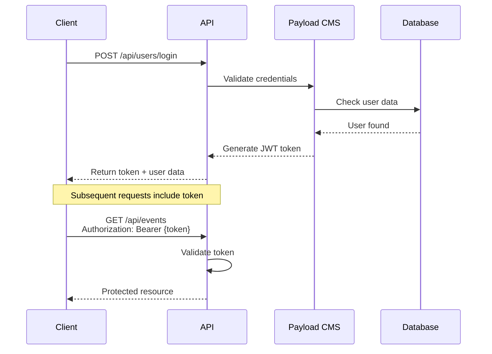

# 🔌 **API Specifications**

## *Complete API Reference for Rotary Club Tunis Doyen CMS*

---

## 📋 **API Overview**

The Rotary Club Tunis Doyen CMS API provides a comprehensive REST interface for content management, user authentication, and administrative operations. Built on Payload CMS v3 with Next.js API routes, the API is optimized for mobile performance and Arabic content delivery.

### **Base Information**

| Property | Value |
|----------|-------|
| **Base URL** | `https://rotary-tunis-doyen.vercel.app/api` |
| **Protocol** | REST with JSON |
| **Authentication** | JWT Bearer tokens |
| **Rate Limiting** | 100 requests per 15 minutes |
| **CORS** | Configured for authorized domains |
| **Version** | v1.0 |

### **Response Format**

All API responses follow a consistent JSON structure:

```typescript
interface APIResponse<T = any> {
  success: boolean;
  data?: T;
  error?: string;
  message?: string;
  pagination?: {
    page: number;
    limit: number;
    totalDocs: number;
    totalPages: number;
    hasNextPage: boolean;
    hasPrevPage: boolean;
  };
}
```

---

## 🔐 **Authentication**

### **JWT Authentication Flow**



### **Login Endpoint**

**Endpoint:** `POST /api/users/login`

**Request Body:**
```typescript
interface LoginRequest {
  email: string;
  password: string;
}
```

**Response:**
```typescript
interface LoginResponse {
  success: true;
  data: {
    token: string;
    user: {
      id: string;
      email: string;
      name: string;
      role: 'volunteer' | 'editor' | 'admin';
      languagePreference: 'fr' | 'ar' | 'en';
    };
    exp: number; // Token expiration timestamp
  };
}
```

**Error Response:**
```typescript
interface ErrorResponse {
  success: false;
  error: 'INVALID_CREDENTIALS' | 'ACCOUNT_LOCKED' | 'RATE_LIMITED';
  message: string;
}
```

### **Token Refresh**

**Endpoint:** `POST /api/auth/refresh`

**Headers:**
```
Authorization: Bearer {expired-token}
```

**Response:**
```typescript
interface RefreshResponse {
  success: true;
  data: {
    token: string; // New token
    exp: number;
  };
}
```

---

## 📊 **Events API**

### **Get Events**

**Endpoint:** `GET /api/events`

**Query Parameters:**
```typescript
interface EventsQuery {
  // Content filters
  locale?: 'fr' | 'ar' | 'en';
  where?: {
    status?: { equals: 'draft' | 'published' | 'archived' };
    eventDate?: { greater_than: string; less_than: string };
    areasOfFocus?: { in: string[] };
    createdBy?: { equals: string };
  };

  // Pagination
  page?: number;
  limit?: number;

  // Relations
  depth?: number;

  // Sorting
  sort?: string; // e.g., "-eventDate" for newest first
}
```

**Example Request:**
```bash
curl "https://rotary-tunis-doyen.vercel.app/api/events?locale=ar&where[status][equals]=published&limit=10"
```

**Response:**
```typescript
interface EventsResponse {
  success: true;
  data: {
    docs: Event[];
    totalDocs: number;
    totalPages: number;
    page: number;
    limit: number;
    hasNextPage: boolean;
    hasPrevPage: boolean;
  };
}

interface Event {
  id: string;
  title: LocalizedContent;
  slug: LocalizedContent;
  eventDate: string; // ISO date string
  location: LocalizedContent;
  description: LocalizedContent;
  areasOfFocus: string[];
  impactMetrics: ImpactMetrics;
  gallery: MediaItem[];
  status: 'draft' | 'published' | 'archived';
  createdBy: string;
  createdAt: string;
  updatedAt: string;
}

interface LocalizedContent {
  fr: string;
  ar: string;
  en?: string;
}

interface ImpactMetrics {
  mealsServed?: number;
  treesPlanted?: number;
  volunteerHours?: number;
}

interface MediaItem {
  id: string;
  image: {
    id: string;
    url: string;
    altText: LocalizedContent;
  };
  caption?: LocalizedContent;
  consentObtained: boolean;
}
```

### **Create Event**

**Endpoint:** `POST /api/events`

**Headers:**
```
Authorization: Bearer {token}
Content-Type: application/json
```

**Request Body:**
```typescript
interface CreateEventRequest {
  title: LocalizedContent;
  eventDate: string;
  location: LocalizedContent;
  description: LocalizedContent;
  areasOfFocus: string[];
  impactMetrics?: ImpactMetrics;
  gallery?: CreateMediaItem[];
  status?: 'draft' | 'published';
}

interface CreateMediaItem {
  image: string; // Media ID
  caption?: LocalizedContent;
}
```

**Response:**
```typescript
interface CreateEventResponse {
  success: true;
  data: Event;
  message: string;
}
```

### **Update Event**

**Endpoint:** `PATCH /api/events/{id}`

**Headers:**
```
Authorization: Bearer {token}
Content-Type: application/json
```

**Request Body:**
```typescript
interface UpdateEventRequest {
  title?: LocalizedContent;
  eventDate?: string;
  location?: LocalizedContent;
  description?: LocalizedContent;
  areasOfFocus?: string[];
  impactMetrics?: ImpactMetrics;
  gallery?: UpdateMediaItem[];
  status?: 'draft' | 'published' | 'archived';
}

interface UpdateMediaItem {
  id?: string; // For existing items
  image?: string; // Media ID for new items
  caption?: LocalizedContent;
}
```

### **Delete Event**

**Endpoint:** `DELETE /api/events/{id}`

**Headers:**
```
Authorization: Bearer {token}
```

**Response:**
```typescript
interface DeleteEventResponse {
  success: true;
  data: {
    id: string;
    deleted: true;
  };
  message: string;
}
```

---

## 🖼️ **Media API**

### **Get Media**

**Endpoint:** `GET /api/media`

**Query Parameters:**
```typescript
interface MediaQuery {
  where?: {
    consentObtained?: { equals: boolean };
    mimeType?: { in: string[] };
    createdBy?: { equals: string };
  };
  page?: number;
  limit?: number;
  sort?: string;
}
```

**Response:**
```typescript
interface MediaResponse {
  success: true;
  data: {
    docs: Media[];
    totalDocs: number;
    totalPages: number;
    page: number;
    limit: number;
    hasNextPage: boolean;
    hasPrevPage: boolean;
  };
}

interface Media {
  id: string;
  filename: string;
  url: string;
  altText: LocalizedContent;
  mimeType: string;
  filesize: number;
  consentObtained: boolean;
  photographer?: string;
  createdBy: string;
  createdAt: string;
  updatedAt: string;
}
```

### **Upload Media**

**Endpoint:** `POST /api/media`

**Headers:**
```
Authorization: Bearer {token}
Content-Type: multipart/form-data
```

**Form Data:**
```typescript
interface UploadMediaForm {
  file: File; // Image file
  altText_fr: string; // French alt text
  altText_ar: string; // Arabic alt text
  altText_en?: string; // English alt text (optional)
  consentObtained: 'true' | 'false';
}
```

**Response:**
```typescript
interface UploadMediaResponse {
  success: true;
  data: Media;
  message: string;
}
```

### **Update Media**

**Endpoint:** `PATCH /api/media/{id}`

**Headers:**
```
Authorization: Bearer {token}
Content-Type: application/json
```

**Request Body:**
```typescript
interface UpdateMediaRequest {
  altText?: LocalizedContent;
  consentObtained?: boolean;
}
```

---

## 👥 **Users API**

### **Get Current User**

**Endpoint:** `GET /api/users/me`

**Headers:**
```
Authorization: Bearer {token}
```

**Response:**
```typescript
interface CurrentUserResponse {
  success: true;
  data: User;
}

interface User {
  id: string;
  email: string;
  name: string;
  role: 'volunteer' | 'editor' | 'admin';
  languagePreference: 'fr' | 'ar' | 'en';
  createdAt: string;
  updatedAt: string;
}
```

### **Update Profile**

**Endpoint:** `PATCH /api/users/me`

**Headers:**
```
Authorization: Bearer {token}
Content-Type: application/json
```

**Request Body:**
```typescript
interface UpdateProfileRequest {
  name?: string;
  languagePreference?: 'fr' | 'ar' | 'en';
}
```

### **List Users (Admin Only)**

**Endpoint:** `GET /api/users`

**Headers:**
```
Authorization: Bearer {token}
```

**Query Parameters:**
```typescript
interface UsersQuery {
  where?: {
    role?: { equals: string };
    email?: { contains: string };
  };
  page?: number;
  limit?: number;
}
```

---

## 📄 **Articles API**

### **Get Articles**

**Endpoint:** `GET /api/articles`

**Query Parameters:**
```typescript
interface ArticlesQuery {
  locale?: 'fr' | 'ar' | 'en';
  where?: {
    status?: { equals: 'draft' | 'published' | 'archived' };
    tags?: { in: string[] };
    createdBy?: { equals: string };
  };
  page?: number;
  limit?: number;
  sort?: string;
}
```

**Response:**
```typescript
interface ArticlesResponse {
  success: true;
  data: {
    docs: Article[];
    totalDocs: number;
    totalPages: number;
    page: number;
    limit: number;
    hasNextPage: boolean;
    hasPrevPage: boolean;
  };
}

interface Article {
  id: string;
  title: LocalizedContent;
  slug: LocalizedContent;
  content: LocalizedContent;
  excerpt: LocalizedContent;
  featuredImage?: MediaItem;
  tags: string[];
  status: 'draft' | 'published' | 'archived';
  createdBy: string;
  createdAt: string;
  updatedAt: string;
}
```

---

## 📋 **Minutes API (Admin Only)**

### **Get Minutes**

**Endpoint:** `GET /api/minutes`

**Headers:**
```
Authorization: Bearer {token}
```

**Query Parameters:**
```typescript
interface MinutesQuery {
  where?: {
    meetingDate?: { greater_than: string; less_than: string };
    status?: { equals: 'draft' | 'published' | 'archived' };
  };
  page?: number;
  limit?: number;
  sort?: string;
}
```

**Response:**
```typescript
interface MinutesResponse {
  success: true;
  data: {
    docs: MeetingMinutes[];
    totalDocs: number;
    totalPages: number;
    page: number;
    limit: number;
    hasNextPage: boolean;
    hasPrevPage: boolean;
  };
}

interface MeetingMinutes {
  id: string;
  meetingDate: string;
  title: LocalizedContent;
  content: LocalizedContent;
  attendees: string[];
  decisions: LocalizedContent;
  nextMeeting?: string;
  status: 'draft' | 'published' | 'archived';
  createdBy: string;
  createdAt: string;
  updatedAt: string;
}
```

---

## 🔒 **GDPR API**

### **Request Data Export**

**Endpoint:** `POST /api/gdpr/export`

**Headers:**
```
Authorization: Bearer {token}
Content-Type: application/json
```

**Request Body:**
```typescript
interface DataExportRequest {
  email: string; // Must match authenticated user
  format: 'json' | 'pdf';
}
```

**Response:**
```typescript
interface DataExportResponse {
  success: true;
  data: {
    downloadUrl: string; // Pre-signed URL for download
    expiresAt: string; // URL expiration time
    recordCount: number;
  };
  message: string;
}
```

### **Request Data Deletion**

**Endpoint:** `POST /api/gdpr/delete`

**Headers:**
```
Authorization: Bearer {token}
Content-Type: application/json
```

**Request Body:**
```typescript
interface DataDeletionRequest {
  email: string; // Must match authenticated user
  reason: string; // Reason for deletion
  confirm: boolean; // Must be true
}
```

**Response:**
```typescript
interface DataDeletionResponse {
  success: true;
  data: {
    requestId: string;
    estimatedCompletion: string; // When deletion will be processed
    status: 'scheduled';
  };
  message: string;
}
```

---

## 📊 **Analytics API (Admin Only)**

### **Get Content Statistics**

**Endpoint:** `GET /api/analytics/content`

**Headers:**
```
Authorization: Bearer {token}
```

**Query Parameters:**
```typescript
interface AnalyticsQuery {
  startDate?: string; // ISO date
  endDate?: string; // ISO date
  groupBy?: 'day' | 'week' | 'month';
}
```

**Response:**
```typescript
interface ContentAnalyticsResponse {
  success: true;
  data: {
    totalEvents: number;
    totalArticles: number;
    totalMedia: number;
    publishedContent: number;
    draftContent: number;
    arabicContent: number;
    frenchContent: number;
    contentByMonth: Array<{
      month: string;
      events: number;
      articles: number;
      media: number;
    }>;
    topAreasOfFocus: Array<{
      area: string;
      count: number;
    }>;
  };
}
```

### **Get User Activity**

**Endpoint:** `GET /api/analytics/users`

**Headers:**
```
Authorization: Bearer {token}
```

**Response:**
```typescript
interface UserAnalyticsResponse {
  success: true;
  data: {
    totalUsers: number;
    activeUsers: number;
    newUsersThisMonth: number;
    userRoles: {
      volunteer: number;
      editor: number;
      admin: number;
    };
    recentActivity: Array<{
      userId: string;
      action: string;
      timestamp: string;
      details: Record<string, any>;
    }>;
  };
}
```

---

## 🚨 **Error Handling**

### **HTTP Status Codes**

| Code | Meaning | Description |
|------|---------|-------------|
| 200 | OK | Request successful |
| 201 | Created | Resource created successfully |
| 400 | Bad Request | Invalid request data |
| 401 | Unauthorized | Missing or invalid authentication |
| 403 | Forbidden | Insufficient permissions |
| 404 | Not Found | Resource not found |
| 409 | Conflict | Resource conflict (e.g., duplicate) |
| 422 | Unprocessable Entity | Validation errors |
| 429 | Too Many Requests | Rate limit exceeded |
| 500 | Internal Server Error | Server error |

### **Error Response Format**

```typescript
interface ErrorResponse {
  success: false;
  error: string; // Error code
  message: string; // Human-readable message
  details?: Record<string, any>; // Additional error details
  timestamp: string; // Error timestamp
}
```

### **Common Error Codes**

```typescript
enum APIErrorCodes {
  // Authentication errors
  INVALID_TOKEN = 'INVALID_TOKEN',
  TOKEN_EXPIRED = 'TOKEN_EXPIRED',
  INSUFFICIENT_PERMISSIONS = 'INSUFFICIENT_PERMISSIONS',

  // Validation errors
  VALIDATION_ERROR = 'VALIDATION_ERROR',
  REQUIRED_FIELD_MISSING = 'REQUIRED_FIELD_MISSING',
  INVALID_FORMAT = 'INVALID_FORMAT',

  // Content errors
  CONTENT_NOT_FOUND = 'CONTENT_NOT_FOUND',
  DUPLICATE_CONTENT = 'DUPLICATE_CONTENT',
  INVALID_LOCALE = 'INVALID_LOCALE',

  // Media errors
  FILE_TOO_LARGE = 'FILE_TOO_LARGE',
  INVALID_FILE_TYPE = 'INVALID_FILE_TYPE',
  CONSENT_REQUIRED = 'CONSENT_REQUIRED',

  // Rate limiting
  RATE_LIMIT_EXCEEDED = 'RATE_LIMIT_EXCEEDED',

  // System errors
  DATABASE_ERROR = 'DATABASE_ERROR',
  STORAGE_ERROR = 'STORAGE_ERROR',
  EXTERNAL_SERVICE_ERROR = 'EXTERNAL_SERVICE_ERROR'
}
```

---

## 🔄 **Rate Limiting**

### **Rate Limit Headers**

All API responses include rate limiting headers:

```
X-RateLimit-Limit: 100
X-RateLimit-Remaining: 95
X-RateLimit-Reset: 1640995200
X-RateLimit-Retry-After: 900 (only when exceeded)
```

### **Rate Limit Policies**

| Endpoint Type | Limit | Window |
|---------------|-------|--------|
| Authentication | 5 | 15 minutes |
| Content Read | 100 | 15 minutes |
| Content Write | 20 | 15 minutes |
| File Upload | 10 | 15 minutes |
| Admin Operations | 50 | 15 minutes |

### **Rate Limit Response**

```typescript
interface RateLimitError {
  success: false;
  error: 'RATE_LIMIT_EXCEEDED';
  message: 'Too many requests. Please try again later.';
  retryAfter: number; // Seconds to wait
}
```

---

## 🔗 **Cross-References**

### **Related Documentation**
- **[`Technical-Specification-Hub.md`](Technical-Specification-Hub.md)**: Main technical reference
- **[`Database-Schema-Design.md`](Database-Schema-Design.md)**: Database structure details
- **[`Security-Protocols.md`](Security-Protocols.md)**: Authentication and authorization details
- **[`API-Documentation-&-Integration-Guide.md`](API-Documentation-&-Integration-Guide.md)**: Integration examples

### **External Resources**
- [Payload CMS REST API](https://payloadcms.com/docs/rest-api)
- [Next.js API Routes](https://nextjs.org/docs/api-routes/introduction)
- [JWT Best Practices](https://tools.ietf.org/html/rfc7519)
- [REST API Design Guidelines](https://restfulapi.net/)

---

## 📝 **API Changelog**

### **Version 1.0 (Current)**
- Initial API release with full CRUD operations
- JWT authentication with role-based access
- Bilingual content support with localization
- GDPR compliance endpoints
- Rate limiting and security features
- Comprehensive error handling

### **Planned Features**
- GraphQL API endpoint (v1.1)
- Webhook notifications (v1.2)
- Bulk operations (v1.3)
- Advanced search and filtering (v1.4)

---

*This API specification provides comprehensive documentation for the Rotary Club Tunis Doyen CMS API. For questions or support, please contact the development team. Last updated: August 2025.*
