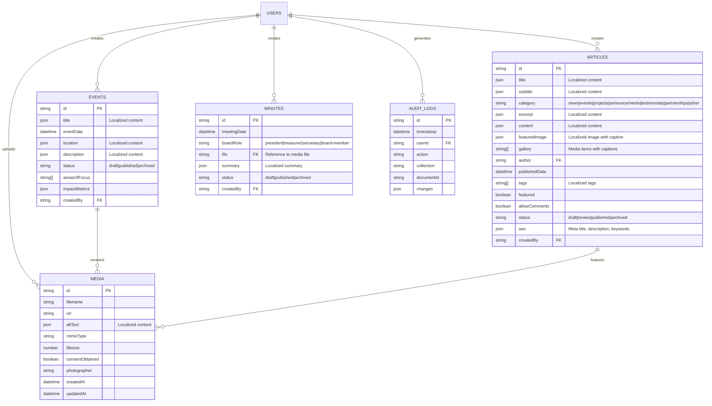

# 🗄️ **Database Schema Design**

## *Complete Database Architecture for Rotary Club Tunis Doyen CMS*

---

## 📋 **Database Overview**

The Rotary Club Tunis Doyen CMS uses MongoDB Atlas as its primary database, chosen for its flexibility with multilingual content, scalability, and global availability. The schema is designed to support field-level localization, GDPR compliance, and efficient querying for both Arabic and French content.

### **Database Specifications**

| Property | Value |
|----------|-------|
| **Database** | MongoDB Atlas M0 Cluster |
| **Version** | MongoDB 6.0+ |
| **Region** | Europe (Frankfurt) - Optimal for Tunisia |
| **Authentication** | SCRAM-SHA-256 |
| **Encryption** | TLS 1.3, Client-side encryption |
| **Backup** | Daily automated backups, 30-day retention |

---

## 🏗️ **Collections Schema**

### **Users Collection**

```javascript
// Collection: users
{
  // Core user information
  _id: ObjectId,
  email: { type: String, required: true, unique: true },
  name: { type: String, required: true },
  role: {
    type: String,
    enum: ['volunteer', 'editor', 'admin'],
    default: 'volunteer',
    required: true
  },
  languagePreference: {
    type: String,
    enum: ['fr', 'ar', 'en'],
    default: 'fr',
    required: true
  },

  // Security fields
  password: { type: String, required: true }, // Hashed with bcrypt
  salt: { type: String, required: true },
  loginAttempts: { type: Number, default: 0 },
  lockUntil: { type: Date },
  lastLogin: { type: Date },

  // Audit fields
  createdAt: { type: Date, default: Date.now },
  updatedAt: { type: Date, default: Date.now },
  createdBy: { type: ObjectId, ref: 'users' },
  updatedBy: { type: ObjectId, ref: 'users' }
}

// Indexes
db.users.createIndex({ email: 1 }, { unique: true });
db.users.createIndex({ role: 1 });
db.users.createIndex({ createdAt: -1 });
```

### **Events Collection**

```javascript
// Collection: events
{
  // Core event information
  _id: ObjectId,
  title: {
    fr: { type: String, required: true },
    ar: { type: String, default: '' },
    en: { type: String, default: '' }
  },
  slug: {
    fr: { type: String, required: true },
    ar: { type: String, default: '' },
    en: { type: String, default: '' }
  },
  eventDate: { type: Date, required: true },
  location: {
    fr: { type: String, required: true },
    ar: { type: String, default: '' },
    en: { type: String, default: '' }
  },
  description: {
    fr: { type: String, required: true },
    ar: { type: String, default: '' },
    en: { type: String, default: '' }
  },

  // Classification
  areasOfFocus: [{
    type: String,
    enum: [
      'peace', 'disease-prevention', 'water', 'education',
      'economic-development', 'environment', 'maternal-child-health', 'other'
    ]
  }],

  // Impact tracking
  impactMetrics: {
    mealsServed: { type: Number, admin: { description: 'Repas servis (chiffre entier)' } },
    treesPlanted: { type: Number, admin: { description: 'Arbres plantés (chiffre entier)' } },
    volunteerHours: { type: Number, admin: { description: 'Heures de bénévolat' } }
  },

  // Media gallery
  gallery: [{
    image: { type: ObjectId, ref: 'media', required: true },
    caption: {
      fr: { type: String, default: '' },
      ar: { type: String, default: '' },
      en: { type: String, default: '' }
    },
    order: { type: Number, default: 0 }
  }],

  // Status and workflow
  status: {
    type: String,
    enum: ['draft', 'published', 'archived'],
    default: 'draft',
    required: true
  },
  publishDate: { type: Date },
  expiryDate: { type: Date },

  // Auto-draft sync tracking
  arabic_draft_created: { type: Boolean, default: false },
  original_language: { type: String, enum: ['fr', 'ar', 'en'] },

  // Audit fields
  createdAt: { type: Date, default: Date.now },
  updatedAt: { type: Date, default: Date.now },
  createdBy: { type: ObjectId, ref: 'users', required: true },
  updatedBy: { type: ObjectId, ref: 'users' }
}

// Indexes
db.events.createIndex({ status: 1, eventDate: -1 });
db.events.createIndex({ areasOfFocus: 1 });
db.events.createIndex({ createdBy: 1 });
db.events.createIndex({ 'title.fr': 'text', 'title.ar': 'text', 'description.fr': 'text', 'description.ar': 'text' });
```

### **Media Collection**

```javascript
// Collection: media
{
  // File information
  _id: ObjectId,
  filename: { type: String, required: true },
  originalName: { type: String, required: true },
  url: { type: String, required: true },
  mimeType: {
    type: String,
    enum: ['image/jpeg', 'image/png', 'image/webp', 'image/gif'],
    required: true
  },
  filesize: { type: Number, required: true },

  // Image dimensions
  width: { type: Number },
  height: { type: Number },
  aspectRatio: { type: Number },

  // Accessibility and localization
  altText: {
    fr: { type: String, required: true },
    ar: { type: String, required: true },
    en: { type: String, default: '' }
  },

  // Privacy and consent
  consentObtained: { type: Boolean, default: false, required: true },
  consentDetails: {
    obtainedFrom: { type: String }, // Person who gave consent
    obtainedDate: { type: Date },
    consentMethod: { type: String, enum: ['verbal', 'written', 'digital'] },
    witness: { type: String }
  },

  // Metadata
  metadata: {
    exif: { type: Object }, // Stripped for privacy
    colors: [{ type: String }], // Dominant colors
    dominantColor: { type: String },
    blurhash: { type: String }, // For progressive loading
    tags: [{ type: String }], // AI-generated tags
    location: {
      latitude: { type: Number },
      longitude: { type: Number },
      address: { type: String }
    }
  },

  // Optimization
  sizes: {
    thumbnail: {
      url: { type: String },
      width: { type: Number, default: 300 },
      height: { type: Number, default: 300 }
    },
    card: {
      url: { type: String },
      width: { type: Number, default: 600 },
      height: { type: Number, default: 400 }
    },
    large: {
      url: { type: String },
      width: { type: Number, default: 1200 },
      height: { type: Number, default: 800 }
    }
  },

  // Audit fields
  createdAt: { type: Date, default: Date.now },
  updatedAt: { type: Date, default: Date.now },
  createdBy: { type: ObjectId, ref: 'users', required: true },
  updatedBy: { type: ObjectId, ref: 'users' }
}

// Indexes
db.media.createIndex({ consentObtained: 1, createdAt: -1 });
db.media.createIndex({ mimeType: 1 });
db.media.createIndex({ createdBy: 1 });
db.media.createIndex({ 'metadata.tags': 1 });
```

### **Articles Collection**

```javascript
// Collection: articles
{
  // Core article information
  _id: ObjectId,
  title: {
    fr: { type: String, required: true },
    ar: { type: String, default: '' },
    en: { type: String, default: '' }
  },
  slug: {
    fr: { type: String, required: true },
    ar: { type: String, default: '' },
    en: { type: String, default: '' }
  },
  content: {
    fr: { type: String, required: true },
    ar: { type: String, default: '' },
    en: { type: String, default: '' }
  },
  excerpt: {
    fr: { type: String, required: true },
    ar: { type: String, default: '' },
    en: { type: String, default: '' }
  },

  // Media
  featuredImage: {
    image: { type: ObjectId, ref: 'media' },
    caption: {
      fr: { type: String, default: '' },
      ar: { type: String, default: '' },
      en: { type: String, default: '' }
    }
  },

  // Classification
  tags: [{ type: String }],
  categories: [{
    type: String,
    enum: ['news', 'announcement', 'project', 'event', 'testimonial']
  }],

  // SEO
  seo: {
    metaTitle: {
      fr: { type: String },
      ar: { type: String },
      en: { type: String }
    },
    metaDescription: {
      fr: { type: String },
      ar: { type: String },
      en: { type: String }
    },
    keywords: [{ type: String }]
  },

  // Status and workflow
  status: {
    type: String,
    enum: ['draft', 'published', 'archived'],
    default: 'draft',
    required: true
  },
  publishDate: { type: Date },
  featured: { type: Boolean, default: false },

  // Audit fields
  createdAt: { type: Date, default: Date.now },
  updatedAt: { type: Date, default: Date.now },
  createdBy: { type: ObjectId, ref: 'users', required: true },
  updatedBy: { type: ObjectId, ref: 'users' }
}

// Indexes
db.articles.createIndex({ status: 1, publishDate: -1 });
db.articles.createIndex({ tags: 1 });
db.articles.createIndex({ categories: 1 });
db.articles.createIndex({ featured: 1 });
db.articles.createIndex({ 'title.fr': 'text', 'title.ar': 'text', 'content.fr': 'text', 'content.ar': 'text' });
```

### **Minutes Collection (Admin Only)**

```javascript
// Collection: minutes
{
  // Meeting information
  _id: ObjectId,
  meetingDate: { type: Date, required: true },
  title: {
    fr: { type: String, required: true },
    ar: { type: String, default: '' },
    en: { type: String, default: '' }
  },

  // Content
  content: {
    fr: { type: String, required: true },
    ar: { type: String, default: '' },
    en: { type: String, default: '' }
  },

  // Participants
  attendees: [{
    userId: { type: ObjectId, ref: 'users' },
    name: { type: String, required: true },
    role: { type: String, enum: ['chair', 'secretary', 'member', 'guest'] }
  }],

  // Decisions and actions
  decisions: {
    fr: { type: String, default: '' },
    ar: { type: String, default: '' },
    en: { type: String, default: '' }
  },
  actionItems: [{
    description: {
      fr: { type: String, required: true },
      ar: { type: String, default: '' },
      en: { type: String, default: '' }
    },
    assignedTo: { type: ObjectId, ref: 'users' },
    dueDate: { type: Date },
    status: {
      type: String,
      enum: ['pending', 'in-progress', 'completed'],
      default: 'pending'
    }
  }],

  // Next meeting
  nextMeeting: {
    date: { type: Date },
    location: { type: String },
    agenda: {
      fr: { type: String },
      ar: { type: String },
      en: { type: String }
    }
  },

  // Status and workflow
  status: {
    type: String,
    enum: ['draft', 'published', 'archived'],
    default: 'draft',
    required: true
  },

  // Audit fields
  createdAt: { type: Date, default: Date.now },
  updatedAt: { type: Date, default: Date.now },
  createdBy: { type: ObjectId, ref: 'users', required: true },
  updatedBy: { type: ObjectId, ref: 'users' }
}

// Indexes
db.minutes.createIndex({ meetingDate: -1 });
db.minutes.createIndex({ status: 1 });
db.minutes.createIndex({ 'attendees.userId': 1 });
```

### **Audit Logs Collection**

```javascript
// Collection: audit_logs
{
  // Log entry
  _id: ObjectId,
  timestamp: { type: Date, default: Date.now },

  // User information
  userId: { type: ObjectId, ref: 'users' },
  userEmail: { type: String },
  userRole: { type: String },

  // Action information
  action: {
    type: String,
    enum: ['create', 'update', 'delete', 'login', 'logout', 'export', 'upload'],
    required: true
  },
  collection: { type: String, required: true },
  documentId: { type: ObjectId },

  // Change details
  changes: {
    before: { type: Object },
    after: { type: Object },
    fields: [{ type: String }] // Changed field names
  },

  // Context
  ipAddress: { type: String },
  userAgent: { type: String },
  sessionId: { type: String },

  // Metadata
  reason: { type: String }, // User-provided reason
  automated: { type: Boolean, default: false }, // System vs user action
  success: { type: Boolean, default: true },
  error: { type: String }
}

// Indexes
db.audit_logs.createIndex({ timestamp: -1 });
db.audit_logs.createIndex({ userId: 1 });
db.audit_logs.createIndex({ collection: 1 });
db.audit_logs.createIndex({ action: 1 });
db.audit_logs.createIndex({ timestamp: -1, collection: 1 });
```

---

## 🔗 **Relationships & References**

### **Entity Relationship Diagram**



---

## 🔍 **Indexing Strategy**

### **Performance Indexes**

```javascript
// Core performance indexes
db.events.createIndex({ status: 1, eventDate: -1 });
db.events.createIndex({ areasOfFocus: 1 });
db.events.createIndex({ createdBy: 1 });
db.events.createIndex({
  'title.fr': 'text',
  'title.ar': 'text',
  'description.fr': 'text',
  'description.ar': 'text'
}, {
  weights: {
    'title.fr': 10,
    'title.ar': 10,
    'description.fr': 5,
    'description.ar': 5
  }
});

db.articles.createIndex({ status: 1, publishDate: -1 });
db.articles.createIndex({ tags: 1 });
db.articles.createIndex({ categories: 1 });
db.articles.createIndex({ featured: 1 });

db.media.createIndex({ consentObtained: 1, createdAt: -1 });
db.media.createIndex({ mimeType: 1 });
db.media.createIndex({ createdBy: 1 });

db.minutes.createIndex({ meetingDate: -1 });
db.minutes.createIndex({ status: 1 });

db.audit_logs.createIndex({ timestamp: -1 });
db.audit_logs.createIndex({ userId: 1, timestamp: -1 });
db.audit_logs.createIndex({ collection: 1, timestamp: -1 });
```

### **Compound Indexes for Common Queries**

```javascript
// Events by status and date range
db.events.createIndex({ status: 1, eventDate: -1 });

// Events by area of focus and status
db.events.createIndex({ areasOfFocus: 1, status: 1 });

// Media by consent and creation date
db.media.createIndex({ consentObtained: 1, createdAt: -1 });

// Articles by category and publish date
db.articles.createIndex({ categories: 1, publishDate: -1 });

// Audit logs by user and time range
db.audit_logs.createIndex({ userId: 1, timestamp: -1 });
```

---

## 🔒 **Security Schema**

### **Field-Level Security**

```javascript
// Security configuration for each collection
const securityConfig = {
  users: {
    read: ({ req }) => {
      if (req.user.role === 'admin') return true;
      return { id: { equals: req.user.id } };
    },
    create: ({ req }) => req.user.role === 'admin',
    update: ({ req }) => {
      if (req.user.role === 'admin') return true;
      return { id: { equals: req.user.id } };
    },
    delete: ({ req }) => req.user.role === 'admin'
  },

  events: {
    read: () => true, // Public read access
    create: ({ req }) => ['volunteer', 'editor', 'admin'].includes(req.user.role),
    update: ({ req, doc }) => {
      if (req.user.role === 'admin') return true;
      if (req.user.role === 'editor') return true;
      return { createdBy: { equals: req.user.id } };
    },
    delete: ({ req }) => req.user.role === 'admin'
  },

  minutes: {
    read: ({ req }) => req.user.role === 'admin',
    create: ({ req }) => req.user.role === 'admin',
    update: ({ req }) => req.user.role === 'admin',
    delete: ({ req }) => req.user.role === 'admin'
  }
};
```

### **Data Encryption Strategy**

```javascript
// Client-side encryption for sensitive fields
const encryptionConfig = {
  // Encrypt sensitive media metadata
  media: {
    encryptFields: ['metadata.location', 'metadata.exif'],
    algorithm: 'AES-256-GCM'
  },

  // Encrypt audit log details
  audit_logs: {
    encryptFields: ['changes.before', 'changes.after'],
    algorithm: 'AES-256-GCM'
  }
};
```

---

## 📊 **Data Migration Strategy**

### **Migration Scripts Structure**

```javascript
// Migration template
const migrationTemplate = {
  version: '1.0.0',
  description: 'Add impact metrics to events',
  up: async (db) => {
    // Migration logic
    await db.collection('events').updateMany(
      { impactMetrics: { $exists: false } },
      {
        $set: {
          impactMetrics: {
            mealsServed: 0,
            treesPlanted: 0,
            volunteerHours: 0,
            peopleReached: 0
          }
        }
      }
    );
  },
  down: async (db) => {
    // Rollback logic
    await db.collection('events').updateMany(
      {},
      { $unset: { impactMetrics: 1 } }
    );
  }
};
```

### **Migration Best Practices**

1. **Version Control**: All migrations are versioned and tracked
2. **Idempotent**: Migrations can be run multiple times safely
3. **Rollback**: Every migration has a corresponding rollback script
4. **Testing**: Migrations are tested in staging before production
5. **Backup**: Full database backup before running migrations

---

## 📈 **Performance Optimization**

### **Query Optimization Patterns**

```javascript
// Optimized event query with aggregation
const getEventsWithImpact = async (locale = 'fr') => {
  return await db.collection('events').aggregate([
    {
      $match: {
        status: 'published',
        [`title.${locale}`]: { $exists: true, $ne: '' }
      }
    },
    {
      $lookup: {
        from: 'media',
        localField: 'gallery.image',
        foreignField: '_id',
        as: 'mediaDetails'
      }
    },
    {
      $project: {
        title: `$title.${locale}`,
        description: `$description.${locale}`,
        eventDate: 1,
        location: `$location.${locale}`,
        areasOfFocus: 1,
        impactMetrics: 1,
        mediaCount: { $size: '$gallery' },
        createdAt: 1
      }
    },
    {
      $group: {
        _id: '$areasOfFocus',
        events: { $push: '$$ROOT' },
        totalImpact: {
          $sum: '$impactMetrics.volunteerHours'
        }
      }
    },
    { $sort: { totalImpact: -1 } }
  ]);
};
```

### **Caching Strategy**

```javascript
// Redis caching configuration
const cacheStrategy = {
  // Cache published content for 5 minutes
  publishedContent: {
    ttl: 300,
    keyPattern: 'content:{locale}:{type}:{page}'
  },

  // Cache user sessions for 7 days
  userSession: {
    ttl: 604800,
    keyPattern: 'session:{userId}'
  },

  // Cache media metadata for 1 hour
  mediaMetadata: {
    ttl: 3600,
    keyPattern: 'media:{id}:meta'
  }
};
```

---

## 🔄 **Backup & Recovery**

### **Backup Strategy**

```javascript
// Automated backup configuration
const backupConfig = {
  // Daily full backup
  schedule: '0 2 * * *', // 2 AM daily
  retention: {
    daily: 30,   // Keep 30 daily backups
    weekly: 12,  // Keep 12 weekly backups
    monthly: 12  // Keep 12 monthly backups
  },
  destinations: [
    'mongodb-atlas-automated',
    'backblaze-b2-rotary-backups',
    'local-encrypted-drive'
  ],
  encryption: {
    algorithm: 'AES-256',
    keyRotation: 'quarterly'
  }
};
```

### **Recovery Procedures**

```javascript
// Point-in-time recovery
const recoveryProcedures = {
  // Full database restore
  fullRestore: async (backupTimestamp) => {
    // 1. Stop application
    // 2. Drop current database
    // 3. Restore from backup
    // 4. Run data validation
    // 5. Restart application
  },

  // Collection-level restore
  collectionRestore: async (collectionName, backupTimestamp) => {
    // 1. Export collection from backup
    // 2. Import to current database
    // 3. Update indexes
    // 4. Validate data integrity
  },

  // Document-level restore
  documentRestore: async (collectionName, documentId, backupTimestamp) => {
    // 1. Find document in backup
    // 2. Restore to current database
    // 3. Update related documents
    // 4. Log restoration
  }
};
```

---

## 📊 **Monitoring & Analytics**

### **Database Performance Metrics**

```javascript
// Key performance indicators
const performanceMetrics = {
  // Query performance
  slowQueries: {
    threshold: 100, // ms
    alert: true
  },

  // Connection pool
  connections: {
    max: 100,
    alertThreshold: 80
  },

  // Storage usage
  storage: {
    alertThreshold: 80, // percentage
    growthRate: 'daily'
  },

  // Replication lag
  replicationLag: {
    threshold: 30, // seconds
    alert: true
  }
};
```

### **Query Performance Monitoring**

```javascript
// Enable query profiling
db.setProfilingLevel(1, { slowms: 100 });

// Monitor slow queries
db.system.profile.find({
  millis: { $gt: 100 }
}).sort({ ts: -1 }).limit(10);

// Create performance dashboard
const performanceDashboard = {
  // Average query time by collection
  queryPerformance: async () => {
    return await db.system.profile.aggregate([
      { $group: {
        _id: '$ns',
        avgTime: { $avg: '$millis' },
        count: { $sum: 1 },
        maxTime: { $max: '$millis' }
      }},
      { $sort: { avgTime: -1 } }
    ]);
  }
};
```

---

## 🔗 **Cross-References**

### **Related Documentation**
- **[`Technical-Specification-Hub.md`](Technical-Specification-Hub.md)**: Main technical reference
- **[`API-Specifications.md`](API-Specifications.md)**: API endpoints and data structures
- **[`Security-Protocols.md`](Security-Protocols.md)**: Security implementation details
- **[`Performance-Optimization.md`](Performance-Optimization.md)**: Performance tuning guidelines

### **External Resources**
- [MongoDB Schema Design Best Practices](https://docs.mongodb.com/manual/core/schema-design/)
- [MongoDB Indexing Strategies](https://docs.mongodb.com/manual/indexes/)
- [MongoDB Security Best Practices](https://docs.mongodb.com/manual/security/)
- [MongoDB Performance Optimization](https://docs.mongodb.com/manual/performance/)

---

*This database schema design provides the foundation for the Rotary Club Tunis Doyen CMS data architecture. The design prioritizes performance, security, and scalability while supporting bilingual content and GDPR compliance. Last updated: August 2025.*
