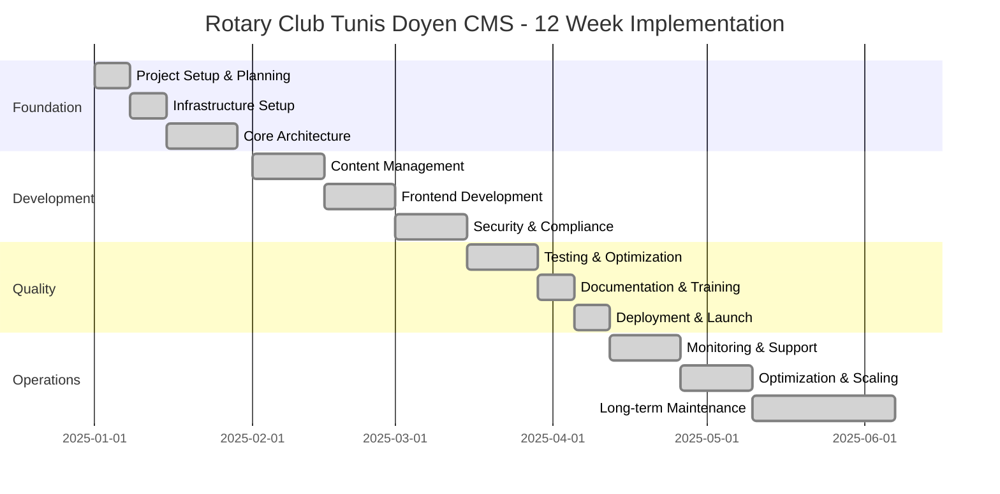

# 🛣️ **Implementation Roadmap**

## *Complete Project Execution Plan for Rotary Club Tunis Doyen CMS*

---

## 📋 **Roadmap Overview**

This implementation roadmap provides a comprehensive, phased approach to building the Rotary Club Tunis Doyen CMS. The roadmap is structured for a 12-week implementation timeline with clear milestones, deliverables, and success criteria. Each phase includes detailed tasks, dependencies, and risk mitigation strategies.

### **Project Timeline**



### **Team Structure**

| Role | Responsibilities | Skills Required |
|------|------------------|-----------------|
| **Project Manager** | Timeline, stakeholder management, risk mitigation | Project management, Rotary knowledge |
| **Backend Developer** | Payload CMS, API, database, security | Node.js, MongoDB, TypeScript |
| **Frontend Developer** | Next.js, UI/UX, performance optimization | React, TypeScript, CSS |
| **DevOps Engineer** | Infrastructure, deployment, monitoring | AWS/Vercel, Docker, monitoring |
| **UI/UX Designer** | Wireframes, design system, accessibility | Figma, accessibility, Arabic UX |
| **QA Engineer** | Testing, quality assurance, documentation | Testing frameworks, Arabic language |
| **Security Consultant** | GDPR compliance, security audit | Security, privacy law, risk assessment |

---

## 📋 **Phase 1: Foundation (Weeks 1-2)**

### **Week 1: Project Setup & Planning**

#### **Objectives**
- Establish project foundation and governance
- Define technical architecture and requirements
- Set up development environment and tools
- Create project documentation structure

#### **Key Deliverables**
- ✅ Project charter and scope document
- ✅ Technical architecture specification
- ✅ Development environment setup
- ✅ Initial documentation framework
- ✅ Risk assessment and mitigation plan

#### **Detailed Tasks**

**Day 1-2: Project Kickoff**
```typescript
// Project initialization checklist
const projectSetup = {
  repository: {
    create: 'rotary-tunis-cms',
    setup: 'GitHub Actions CI/CD',
    protect: 'main branch protection',
    access: 'team member invitations'
  },
  documentation: {
    structure: 'Create folder hierarchy',
    templates: 'Setup documentation templates',
    guidelines: 'Establish writing standards'
  },
  communication: {
    channels: 'Slack/Teams setup',
    meetings: 'Weekly standup schedule',
    reporting: 'Progress tracking system'
  }
};
```

**Day 3-5: Requirements Gathering**
- Stakeholder workshops (2 hours each)
- User persona development
- Functional requirements specification
- Non-functional requirements definition
- Success metrics establishment

**Day 6-7: Architecture Design**
- Technology stack selection
- System architecture design
- Database schema planning
- Security architecture design
- Performance requirements definition

#### **Success Criteria**
- [ ] All stakeholders aligned on project scope
- [ ] Technical architecture approved
- [ ] Development environment operational
- [ ] Documentation structure established
- [ ] Risk register created and reviewed

### **Week 2: Infrastructure Setup**

#### **Objectives**
- Establish development and staging environments
- Configure cloud infrastructure
- Set up CI/CD pipelines
- Implement monitoring and logging

#### **Key Deliverables**
- ✅ Development environment fully operational
- ✅ Staging environment deployed
- ✅ CI/CD pipeline configured
- ✅ Monitoring and alerting setup
- ✅ Backup and recovery procedures

#### **Detailed Tasks**

**Infrastructure Setup**
```bash
# Vercel project setup
vercel login
vercel init rotary-tunis-cms
vercel env add PAYLOAD_SECRET
vercel env add MONGODB_URI
vercel env add JWT_SECRET
vercel env add REDIS_URL

# MongoDB Atlas setup
mongosh "mongodb+srv://cluster.mongodb.net" --apiVersion 1 --username admin
db.createCollection("events")
db.createCollection("media")
db.createCollection("users")
```

**Database Configuration**
- MongoDB Atlas cluster setup (M0)
- Database user creation with least privilege
- IP whitelist configuration for Vercel
- Backup schedule configuration
- Performance monitoring setup

**Development Tools**
- ESLint and Prettier configuration
- TypeScript strict mode setup
- Testing framework configuration
- Documentation generation setup

#### **Success Criteria**
- [ ] All team members can deploy to staging
- [ ] CI/CD pipeline working correctly
- [ ] Database connections established
- [ ] Monitoring dashboards accessible
- [ ] Backup verification completed

---

## 📋 **Phase 2: Core Development (Weeks 3-6)**

### **Week 3-4: Content Management System**

#### **Objectives**
- Implement Payload CMS configuration
- Develop collection schemas
- Create content management workflows
- Implement bilingual content support

#### **Key Deliverables**
- ✅ Payload CMS fully configured
- ✅ All collections implemented
- ✅ Bilingual content support working
- ✅ Auto-draft sync system operational
- ✅ Basic content workflows functional

#### **Detailed Tasks**

**Payload CMS Setup**
```typescript
// payload.config.ts
import { buildConfig } from 'payload/config';
import Events from './collections/Events';
import Media from './collections/Media';
import Users from './collections/Users';

export default buildConfig({
  serverURL: process.env.PAYLOAD_PUBLIC_SERVER_URL,
  admin: {
    user: Users.slug,
  },
  collections: [Events, Media, Users],
  localization: {
    locales: [
      { label: 'Français', code: 'fr' },
      { label: 'العربية', code: 'ar' },
      { label: 'English', code: 'en' }
    ],
    defaultLocale: 'fr',
    fallback: true
  },
  upload: {
    limits: {
      fileSize: 5000000, // 5MB
    },
  },
});
```

**Collection Implementation**
- Events collection with impact metrics
- Media collection with consent tracking
- Users collection with role-based access
- Articles collection for news content
- Minutes collection for governance

**Bilingual Features**
- Field-level localization setup
- Arabic RTL configuration
- Language cascade implementation
- Auto-draft sync system development

#### **Success Criteria**
- [ ] Content can be created in all three languages
- [ ] Arabic RTL displays correctly
- [ ] Auto-draft sync functions properly
- [ ] Media upload with consent tracking works
- [ ] Role-based permissions enforced

### **Week 5-6: Frontend Development**

#### **Objectives**
- Build responsive Next.js application
- Implement design system and components
- Create user-friendly admin interface
- Optimize for mobile performance

#### **Key Deliverables**
- ✅ Responsive frontend application
- ✅ Complete component library
- ✅ Volunteer-friendly admin interface
- ✅ Mobile-optimized experience
- ✅ Performance targets met

#### **Detailed Tasks**

**Next.js Application Setup**
```typescript
// next.config.js
module.exports = {
  i18n: {
    locales: ['fr', 'ar', 'en'],
    defaultLocale: 'fr',
    localeDetection: false,
  },
  images: {
    domains: ['rotary-tunis-doyen.vercel.app'],
    formats: ['image/webp', 'image/avif'],
  },
  async rewrites() {
    return [
      {
        source: '/admin/:path*',
        destination: '/api/admin/:path*',
      },
    ];
  },
};
```

**Component Development**
- Design system implementation
- Form components with validation
- Media upload components
- Navigation and layout components
- Loading and error states

**Admin Interface**
- Dashboard with quick actions
- Content creation forms
- Media management interface
- User management panels
- Settings and configuration

#### **Success Criteria**
- [ ] All pages load in <3 seconds
- [ ] Mobile interface fully functional
- [ ] Content creation workflow complete
- [ ] Arabic interface works correctly
- [ ] Performance budget met

---

## 📋 **Phase 3: Security & Compliance (Weeks 7-8)**

### **Week 7: Security Implementation**

#### **Objectives**
- Implement authentication and authorization
- Set up data encryption and protection
- Configure security monitoring
- Establish audit logging

#### **Key Deliverables**
- ✅ JWT authentication system
- ✅ Role-based access control
- ✅ Data encryption implemented
- ✅ Security monitoring active
- ✅ Audit logging operational

#### **Detailed Tasks**

**Authentication System**
```typescript
// JWT authentication middleware
export const authenticate = async (req: Request) => {
  const token = req.headers.authorization?.replace('Bearer ', '');

  if (!token) {
    throw new Error('No token provided');
  }

  try {
    const decoded = jwt.verify(token, process.env.JWT_SECRET);
    const user = await payload.findByID({
      collection: 'users',
      id: decoded.id
    });

    if (!user) {
      throw new Error('User not found');
    }

    req.user = user;
    return user;
  } catch (error) {
    throw new Error('Invalid token');
  }
};
```

**Security Features**
- Password hashing and validation
- Rate limiting implementation
- Input sanitization and validation
- CSRF protection setup
- Security headers configuration

#### **Success Criteria**
- [ ] All authentication flows working
- [ ] Password security requirements met
- [ ] Role-based access enforced
- [ ] Security monitoring active
- [ ] Audit logs being generated

### **Week 8: GDPR Compliance**

#### **Objectives**
- Implement GDPR compliance features
- Set up data subject rights handling
- Configure consent management
- Establish data retention policies

#### **Key Deliverables**
- ✅ GDPR compliance framework
- ✅ Data export functionality
- ✅ Consent management system
- ✅ Privacy policy published
- ✅ Data retention policies implemented

#### **Detailed Tasks**

**GDPR Implementation**
```typescript
// Data export functionality
export const exportUserData = async (userId: string) => {
  // Collect all user data
  const user = await payload.findByID({ collection: 'users', id: userId });
  const events = await payload.find({
    collection: 'events',
    where: { createdBy: { equals: userId } }
  });
  const media = await payload.find({
    collection: 'media',
    where: { createdBy: { equals: userId } }
  });

  // Create comprehensive export
  const exportData = {
    user: {
      id: user.id,
      email: user.email,
      name: user.name,
      createdAt: user.createdAt,
      languagePreference: user.languagePreference
    },
    events: events.docs,
    media: media.docs,
    auditLog: await getUserAuditLog(userId),
    consentRecords: await getUserConsents(userId)
  };

  return exportData;
};
```

**Compliance Features**
- Data export API endpoints
- Data deletion procedures
- Consent management system
- Privacy policy integration
- Cookie consent implementation

#### **Success Criteria**
- [ ] Data export functionality working
- [ ] Consent management operational
- [ ] Privacy policy accessible
- [ ] GDPR compliance checklist complete
- [ ] Data retention policies documented

---

## 📋 **Phase 4: Quality Assurance (Weeks 9-10)**

### **Week 9: Testing Implementation**

#### **Objectives**
- Set up comprehensive testing framework
- Implement automated testing pipelines
- Conduct thorough functionality testing
- Perform security and performance testing

#### **Key Deliverables**
- ✅ Complete test suite implemented
- ✅ Automated testing pipeline
- ✅ Security testing completed
- ✅ Performance testing results
- ✅ Bug tracking and resolution

#### **Detailed Tasks**

**Testing Framework Setup**
```typescript
// Jest configuration
const jestConfig = {
  preset: 'ts-jest',
  testEnvironment: 'node',
  testMatch: ['**/__tests__/**/*.test.ts'],
  collectCoverageFrom: [
    'src/**/*.{ts,tsx}',
    '!src/**/*.d.ts',
    '!src/**/__tests__/**'
  ],
  coverageThreshold: {
    global: {
      branches: 80,
      functions: 80,
      lines: 80,
      statements: 80
    }
  }
};
```

**Test Categories**
- Unit tests for all components
- Integration tests for API endpoints
- End-to-end tests for user workflows
- Performance tests for critical paths
- Security tests for authentication and authorization

#### **Success Criteria**
- [ ] Test coverage >80%
- [ ] All critical user workflows tested
- [ ] Security tests passing
- [ ] Performance benchmarks met
- [ ] Automated testing in CI/CD

### **Week 10: Performance Optimization**

#### **Objectives**
- Optimize application performance
- Implement caching strategies
- Optimize database queries
- Conduct mobile performance testing

#### **Key Deliverables**
- ✅ Performance targets achieved
- ✅ Caching implementation complete
- ✅ Database optimization finished
- ✅ Mobile performance optimized
- ✅ Performance monitoring active

#### **Detailed Tasks**

**Performance Optimization**
```typescript
// Redis caching implementation
const cacheManager = {
  async get(key: string) {
    const cached = await redis.get(key);
    return cached ? JSON.parse(cached) : null;
  },

  async set(key: string, data: any, ttl: number = 300) {
    await redis.setex(key, ttl, JSON.stringify(data));
  },

  async invalidate(pattern: string) {
    const keys = await redis.keys(pattern);
    if (keys.length > 0) {
      await redis.del(...keys);
    }
  }
};
```

**Optimization Areas**
- Bundle size optimization
- Image optimization and lazy loading
- Database query optimization
- API response optimization
- CDN and caching configuration

#### **Success Criteria**
- [ ] Core Web Vitals scores excellent
- [ ] Bundle size <200KB
- [ ] API response time <500ms
- [ ] Mobile performance targets met
- [ ] Performance monitoring active

---

## 📋 **Phase 5: Deployment & Launch (Weeks 11-12)**

### **Week 11: Production Deployment**

#### **Objectives**
- Prepare production environment
- Conduct final testing and validation
- Execute deployment procedures
- Set up monitoring and alerting

#### **Key Deliverables**
- ✅ Production environment ready
- ✅ Final testing completed
- ✅ Deployment procedures documented
- ✅ Monitoring and alerting configured
- ✅ Rollback procedures tested

#### **Detailed Tasks**

**Production Deployment**
```bash
# Production deployment checklist
const deploymentChecklist = {
  environment: {
    variables: 'All production env vars set',
    domains: 'Custom domain configured',
    ssl: 'SSL certificates valid',
    cdn: 'CDN configuration active'
  },
  database: {
    migration: 'All migrations applied',
    backup: 'Pre-deployment backup completed',
    indexes: 'All indexes created',
    connection: 'Production connection tested'
  },
  security: {
    headers: 'Security headers configured',
    rateLimit: 'Rate limiting active',
    monitoring: 'Security monitoring active',
    audit: 'Audit logging enabled'
  },
  performance: {
    caching: 'Redis cache configured',
    cdn: 'CDN optimization active',
    images: 'Image optimization enabled',
    monitoring: 'Performance monitoring active'
  }
};
```

**Deployment Process**
- Database migration execution
- Code deployment to production
- Environment configuration validation
- Health checks and smoke tests
- Monitoring activation

#### **Success Criteria**
- [ ] Production environment stable
- [ ] All functionality working correctly
- [ ] Performance targets maintained
- [ ] Security measures active
- [ ] Monitoring and alerting operational

### **Week 12: Launch & Training**

#### **Objectives**
- Conduct volunteer training sessions
- Launch the system to users
- Provide ongoing support
- Monitor initial usage and feedback

#### **Key Deliverables**
- ✅ Volunteer training completed
- ✅ System successfully launched
- ✅ Support procedures established
- ✅ Initial feedback collected
- ✅ Launch success metrics achieved

#### **Detailed Tasks**

**Training Program**
```typescript
// Training session structure
const trainingProgram = {
  session1: {
    title: 'CMS Basics and Navigation',
    duration: '2 hours',
    topics: [
      'System overview and purpose',
      'Login and navigation',
      'Dashboard understanding',
      'Basic terminology'
    ],
    materials: [
      'Quick reference guide',
      'Video demonstration',
      'Practice exercises'
    ]
  },
  session2: {
    title: 'Content Creation',
    duration: '2 hours',
    topics: [
      'Creating events in French',
      'Adding Arabic translations',
      'Uploading and managing photos',
      'Using categories and impact metrics'
    ],
    materials: [
      'Step-by-step guide',
      'Arabic translation tips',
      'Photo consent procedures'
    ]
  },
  session3: {
    title: 'Advanced Features',
    duration: '1.5 hours',
    topics: [
      'Managing existing content',
      'Using advanced features',
      'Troubleshooting common issues',
      'Best practices and tips'
    ],
    materials: [
      'Advanced user guide',
      'Troubleshooting checklist',
      'Best practices document'
    ]
  }
};
```

**Launch Activities**
- System announcement to volunteers
- Training session scheduling and execution
- Support hotline establishment
- Initial usage monitoring
- Feedback collection and analysis

#### **Success Criteria**
- [ ] 80% of volunteers trained
- [ ] System stable for 7 days post-launch
- [ ] Support requests handled within SLA
- [ ] User satisfaction >4.0/5.0
- [ ] Core functionality usage >70%

---

## 📋 **Phase 6: Operations & Maintenance (Ongoing)**

### **Month 1: Monitoring & Support**

#### **Objectives**
- Establish operational procedures
- Monitor system performance and usage
- Provide ongoing user support
- Collect and implement feedback

#### **Key Activities**
- Daily system health monitoring
- Weekly performance reviews
- User support and issue resolution
- Feature usage analysis
- Feedback collection and prioritization

### **Months 2-3: Optimization & Scaling**

#### **Objectives**
- Optimize system performance
- Scale infrastructure as needed
- Implement feature enhancements
- Improve user experience

#### **Key Activities**
- Performance bottleneck identification and resolution
- Infrastructure scaling based on usage patterns
- Feature enhancement based on user feedback
- Process improvement and automation
- Security updates and patches

### **Months 4-6: Long-term Maintenance**

#### **Objectives**
- Establish sustainable maintenance processes
- Plan for future enhancements
- Ensure continued compliance
- Build organizational knowledge

#### **Key Activities**
- Comprehensive system audit
- Technology stack evaluation
- Process documentation and improvement
- Team knowledge transfer
- Future roadmap planning

---

## 🎯 **Success Metrics**

### **Technical Success Criteria**

| Metric | Target | Measurement |
|--------|--------|-------------|
| **System Availability** | 99.5% uptime | Monitoring dashboard |
| **Performance** | <3s page load | Web Vitals |
| **Security** | Zero critical vulnerabilities | Security scans |
| **Mobile Usage** | >60% of sessions | Analytics |
| **API Reliability** | 99.9% success rate | API monitoring |

### **Business Success Criteria**

| Metric | Target | Measurement |
|--------|--------|-------------|
| **User Adoption** | 100% in 2 weeks | Admin analytics |
| **Content Quality** | 80% in Arabic | Manual review |
| **Volunteer Satisfaction** | >4.5/5 | Quarterly survey |
| **Operational Efficiency** | 50% time reduction | User timing |
| **GDPR Compliance** | 100% | External audit |

### **Project Success Criteria**

| Metric | Target | Measurement |
|--------|--------|-------------|
| **Timeline Adherence** | 100% on-time delivery | Project tracking |
| **Budget Adherence** | <5% variance | Financial tracking |
| **Quality Standards** | All acceptance criteria met | QA reports |
| **Stakeholder Satisfaction** | >4.5/5 | Stakeholder survey |
| **Knowledge Transfer** | 100% documentation complete | Documentation audit |

---

## 🚨 **Risk Management**

### **Risk Assessment Matrix**

| Risk | Probability | Impact | Mitigation Strategy |
|------|-------------|--------|-------------------|
| **Technical Complexity** | Medium | High | Phased implementation, expert consultation |
| **Arabic RTL Issues** | Medium | Medium | Early prototyping, Arabic UX expert |
| **Performance Challenges** | Low | High | Performance budget, optimization reviews |
| **Security Vulnerabilities** | Low | High | Security audits, code reviews |
| **User Adoption Resistance** | Medium | Medium | Change management, training program |
| **GDPR Non-compliance** | Low | High | Legal review, compliance testing |
| **Budget Overrun** | Low | Medium | Fixed scope, change control process |
| **Timeline Delays** | Medium | Medium | Buffer time, agile methodology |

### **Contingency Plans**

#### **Technical Issues**
- **Plan**: Daily standup meetings, weekly technical reviews
- **Backup**: External development resources available
- **Communication**: Immediate notification to stakeholders

#### **User Adoption Issues**
- **Plan**: Extended training program, additional support resources
- **Backup**: Change management consultant available
- **Communication**: Regular feedback collection and response

#### **Performance Issues**
- **Plan**: Performance monitoring and optimization sprints
- **Backup**: CDN and caching optimization
- **Communication**: Transparent performance reporting

---

## 📊 **Resource Requirements**

### **Team Resources**

| Role | Weeks Required | Key Skills |
|------|----------------|------------|
| **Project Manager** | 12 weeks | Project management, stakeholder management |
| **Backend Developer** | 12 weeks | Node.js, MongoDB, TypeScript, Payload CMS |
| **Frontend Developer** | 10 weeks | React, Next.js, TypeScript, CSS |
| **DevOps Engineer** | 8 weeks | Vercel, MongoDB Atlas, monitoring |
| **UI/UX Designer** | 6 weeks | Figma, accessibility, Arabic UX |
| **QA Engineer** | 6 weeks | Testing frameworks, Arabic language |
| **Security Consultant** | 4 weeks | GDPR, security, risk assessment |

### **Infrastructure Resources**

| Resource | Specification | Cost Estimate |
|----------|---------------|---------------|
| **Vercel Pro** | Production hosting, CDN | $20/month |
| **MongoDB Atlas M0** | Database hosting | $0 (free tier) |
| **Backblaze B2** | File storage | $5/month |
| **Monitoring** | Performance and security | $10/month |
| **Domain** | Custom domain | $15/year |

### **External Resources**

| Resource | Purpose | Timeline |
|----------|---------|----------|
| **Arabic UX Expert** | RTL and Arabic interface review | Week 4 |
| **Security Auditor** | GDPR compliance assessment | Week 8 |
| **Performance Consultant** | Optimization review | Week 10 |
| **Training Facilitator** | Volunteer training sessions | Week 12 |

---

## 📋 **Communication Plan**

### **Internal Communication**

#### **Daily Standups**
- **Frequency**: Monday-Friday, 9:00 AM
- **Duration**: 15 minutes
- **Attendees**: All team members
- **Format**: What was done yesterday, what will be done today, any blockers

#### **Weekly Reviews**
- **Frequency**: Every Friday, 2:00 PM
- **Duration**: 1 hour
- **Attendees**: Project team + stakeholders
- **Format**: Progress review, risk assessment, upcoming milestones

#### **Monthly Steering Committee**
- **Frequency**: First Friday of each month
- **Duration**: 2 hours
- **Attendees**: Project sponsor, key stakeholders
- **Format**: Strategic review, budget and timeline updates

### **External Communication**

#### **Stakeholder Updates**
- **Frequency**: Bi-weekly
- **Format**: Email updates with progress dashboard
- **Content**: Achievements, upcoming milestones, risks and issues

#### **Volunteer Communication**
- **Pre-launch**: System overview and training schedule
- **Launch**: System availability and support information
- **Post-launch**: Feature updates and feedback requests

---

## 🔗 **Cross-References**

### **Related Documentation**
- **[`Technical-Specification-Hub.md`](Technical-Specification-Hub.md)**: Main technical reference
- **[`System-Architecture-Overview.md`](System-Architecture-Overview.md)**: Architecture details
- **[`Security-Protocols.md`](Security-Protocols.md)**: Security implementation
- **[`Performance-Optimization.md`](Performance-Optimization.md)**: Performance strategies
- **[`00-Glossary.md`](00-Glossary.md)**: Terminology reference

### **External Resources**
- [Agile Project Management](https://www.atlassian.com/agile)
- [GDPR Implementation Guide](https://gdpr.eu/)
- [Web Performance Best Practices](https://web.dev/performance/)
- [MongoDB Atlas Best Practices](https://docs.mongodb.com/atlas/best-practices/)

---

*This implementation roadmap provides a comprehensive, phased approach to successfully delivering the Rotary Club Tunis Doyen CMS. The roadmap is designed to minimize risks, ensure quality, and maximize user adoption while maintaining strict adherence to timelines and budgets. Last updated: August 2025.*