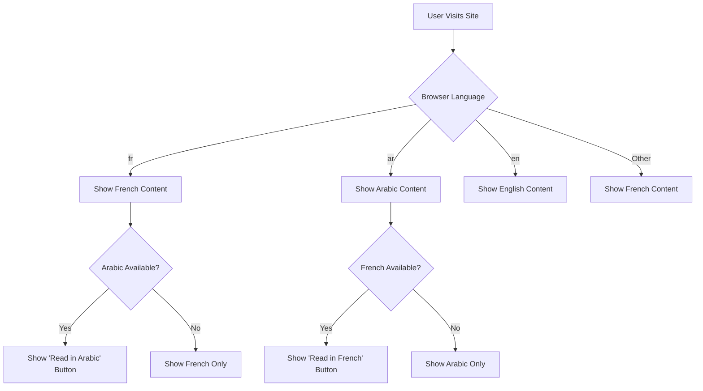

# 🌍 **Rotary Club Tunis Doyen Localization Strategy Guide**  

## *Culturally Intelligent Multilingual Implementation for Tunisia*

> **"This guide ensures our digital platform speaks Tunisian—not just translated words."**  
> *A living document for developers, designers, and content creators*

---

## 📌 **1. Executive Summary**

### **Why This Matters to Rotary Tunis Doyen**
>
> *"Our members serve communities in French, Arabic, and English—but not equally. This strategy ensures our digital platform respects Tunisia's linguistic reality: French as the working language of service, Arabic as the language of cultural identity, and English as the global connector. Most importantly, it prevents content that looks 'translated' rather than authentically Tunisian."*

### **Key Principles**

- ✅ **French-first, not French-only**: French is primary but never displaces Arabic cultural identity
- ✅ **Arabic is more than RTL**: Proper typography and cultural context matter more than direction
- ✅ **No automatic English fallback**: English is tertiary—never used when Arabic content is missing
- ✅ **Tunisian context first**: Local conventions override international standards

---

## 🌐 **2. Language Strategy Framework**

### **2.1 Language Hierarchy & Cascade Rules**

| Element | Rule | Tunisia-Specific Rationale |
|---------|------|----------------------------|
| **Primary Language** | French (`fr`) | Working language of Rotary Tunis Doyen operations |
| **Secondary Language** | Arabic (`ar`) | Language of cultural identity and community connection |
| **Tertiary Language** | English (`en`) | Global Rotary connection (not for local audiences) |
| **Fallback Direction** | French → Arabic → English | **Never** French → English → Arabic (would disrespect local context) |
| **Missing Content** | Show French version | Never auto-translate or show English when Arabic is missing |

### **2.2 Language Selection Workflow**



### **2.3 Critical Implementation Rules**

- **Never** implement automatic translation (Google Translate etc.)
- **Never** use English as fallback for Arabic content
- **Always** validate Arabic content with native speakers before launch
- **Never** display mixed LTR/RTL text in same paragraph block
- **Always** enforce French → Arabic publishing workflow in CMS

---

## ✍️ **3. Content Localization Strategy**

### **3.1 Field-Level Localization Decisions**

| Field | Localized? | Tunisia-Specific Notes |
|-------|------------|------------------------|
| **Title** | ✅ | Must have French AND Arabic versions |
| **Description/Body** | ✅ | Arabic must use proper typography (not just direction) |
| **Event Date** | ❌ | Single date for all languages (event happens once) |
| **Location** | ❌ | Single location name for all languages |
| **Image Alt Text** | ✅ | **Mandatory** French AND Arabic descriptions |
| **Impact Metrics** | ❌ | Single numbers for all languages (meals served = 100) |
| **Author Name** | ❌ | Single name format across languages |
| **Category/Tags** | ✅ | Must map to Rotary's 7 Areas of Focus in all languages |

### **3.2 Content Creation Workflow**

1. **Volunteer creates French content first** (primary working language)
2. **System auto-creates Arabic draft** with `[AR]` prefix
3. **Volunteer adds Arabic translation** (never automatic)
4. **Optional**: Add English version for global sharing
5. **Publish**: Both French and Arabic versions go live together

> 💡 **Why this workflow?**  
> *Tunisian Rotary members think in French but connect with communities in Arabic. This workflow matches their natural process while ensuring Arabic content is human-created, not machine-translated.*

---

## 📅 **4. Date, Number & Formatting Standards**

### **4.1 Date Formatting Rules**

| Context | French (fr-TN) | Arabic (ar-TN) | English (en) |
|---------|----------------|----------------|--------------|
| **Admin UI** | `dd/MM/yyyy` (25/12/2024) | `dd/MM/yyyy` (٢٥/١٢/٢٠٢٤) | `MM/dd/yyyy` (12/25/2024) |
| **Public Frontend** | `dd MMMM yyyy` (25 décembre 2024) | `dd MMMM yyyy` (٢٥ ديسمبر ٢٠٢٤) | `MMMM dd, yyyy` (December 25, 2024) |
| **Time Format** | `HH:mm` (14:30) | `hh:mm ص/م` (٠٢:٣٠ م) | `hh:mm AM/PM` (2:30 PM) |
| **Calendar** | Gregorian | Gregorian + Hijri awareness | Gregorian |

### **4.2 Number Formatting Rules**

| Type | French (fr-TN) | Arabic (ar-TN) | English (en) |
|------|----------------|----------------|--------------|
| **Decimal** | `1 000,5` | `١٬٠٠٠٫٥` | `1,000.5` |
| **Currency** | `1 000,50 €` | `١٬٠٠٠٫٥٠ د.ت` | `$1,000.50` |
| **Percent** | `50,5 %` | `٥٠٫٥٪` | `50.5%` |
| **Phone** | `+216 71 000 000` | `+٢١٦ ٧١ ٠٠٠ ٠٠٠` | `+216 71 000 000` |

### **4.3 Implementation Specifications**

**For Developers:**

```ts
// French date formatting (Tunisian standard)
export const formatFrenchDate = (date: Date) => 
  new Intl.DateTimeFormat('fr-TN', {
    day: '2-digit',
    month: '2-digit',
    year: 'numeric'
  }).format(date);

// Arabic date formatting (Tunisian standard)
export const formatArabicDate = (date: Date) => 
  new Intl.DateTimeFormat('ar-TN', {
    day: '2-digit',
    month: '2-digit',
    year: 'numeric'
  }).format(date);
```

**For Designers:**

- Always use `text-align: right` + `direction: rtl` together for Arabic
- Never use all-caps text in Arabic (breaks readability)
- Line height for Arabic must be ≥ 1.6
- Proper spacing between Arabic/French text blocks (minimum 16px)

---

## 🇹🇳 **5. Tunisia-Specific Arabic Implementation**

### **5.1 Beyond Basic RTL: Proper Arabic Typography**

Most CMS implementations only flip direction (`dir="rtl"`) but neglect true Arabic typography requirements:

| Requirement | ✅ Correct | ❌ Incorrect |
|-------------|-----------|--------------|
| **Text Direction** | `direction: rtl` + `text-align: right` | Only `text-align: right` |
| **Line Height** | ≥ 1.6 | Default browser line height |
| **Punctuation** | Arabic punctuation (،؛؟) | Latin punctuation (,.?!) |
| **Number Forms** | Eastern Arabic numerals (٠١٢٣٤٥٦٧٨٩) | Western Arabic numerals (0123456789) |
| **Font Family** | `font-family: 'Tajawal', sans-serif` | System default fonts |
| **Word Spacing** | Normal spacing | Excessive or insufficient spacing |

### **5.2 Lexical Editor Configuration**

**Critical settings for Arabic content creation:**

```ts
// src/collections/Events.ts
{
  name: 'description',
  type: 'richText',
  localized: true,
  editor: lexicalEditor({
    features: ({ defaultFeatures }) => [
      ...defaultFeatures,
      rtlPlugin({
        className: 'arabic-content',
        defaultDirection: 'rtl'
      })
    ],
  }),
  admin: {
    components: {
      Field: () => <ArabicTypographyValidator />
    }
  }
}
```

**CSS Requirements:**

```css
/* Arabic content styling */
.arabic-content {
  line-height: 1.6;
  text-align: right;
  direction: rtl;
  font-family: 'Tajawal', sans-serif;
  font-size: 16px;
}

/* Proper Arabic typography rules */
.arabic-content p {
  margin-bottom: 1.5em;
}

.arabic-content blockquote {
  border-right: 3px solid #005daa;
  padding-right: 16px;
  margin-right: 0;
}
```

### **5.3 Cultural Content Guidelines**

| Content Type | Do | Don't |
|--------------|----|-------|
| **Images** | • Show diverse Tunisian communities<br>• Respect head covering norms<br>• Proper spacing in group photos | • Crop heads in group photos<br>• Show inappropriate physical contact<br>• Use Western-style poses |
| **Language** | • Use Tunisian Arabic terms where appropriate<br>• Respect formal address conventions<br>• Include religious greetings appropriately | • Use European French terms<br>• Mix formal/informal address<br>• Use religious terms casually |
| **Dates** | • Recognize religious holidays<br>• Note Hijri dates for Ramadan<br>• Use Tunisian French date formats | • Ignore religious context<br>• Use American date formats<br>• Convert Hijri dates incorrectly |

---

## 🧪 **6. Validation & Quality Assurance**

### **6.1 Localization Testing Matrix**

| Test Type | French | Arabic | English | Validation Method |
|-----------|--------|--------|---------|-------------------|
| **Date Formatting** | ✓ | ✓ | ✓ | Verify with Tunisian calendar |
| **Number Formatting** | ✓ | ✓ | ✓ | Check decimal separators |
| **RTL Implementation** | - | ✓ | - | Native speaker review |
| **Line Height** | - | ✓ | - | Measure in dev tools |
| **Alt Text Completeness** | ✓ | ✓ | - | CMS validation |
| **Cultural Appropriateness** | ✓ | ✓ | ✓ | Native speaker review |
| **Mobile Rendering** | ✓ | ✓ | ✓ | Test on Xiaomi Redmi 9A |

### **6.2 Arabic Content Validation Checklist**

```markdown
# ARABIC CONTENT VALIDATION CHECKLIST

## Typography
[ ] Text direction correctly set to RTL (not just alignment)
[ ] Line height ≥ 1.6 for readability
[ ] Proper Arabic punctuation (not Latin)
[ ] Eastern Arabic numerals (٠١٢٣٤٥٦٧٨٩)
[ ] Correct font family (Tajawal)

## Cultural
[ ] No inappropriate imagery for Tunisian context
[ ] Proper religious greetings where appropriate
[ ] Tunisian Arabic terms used correctly
[ ] Formal address conventions respected

## Technical
[ ] Alt text provided in Arabic AND French
[ ] Image cropping respects cultural norms
[ ] Dates formatted per Tunisian Arabic conventions
[ ] No mixed LTR/RTL within same paragraph
```

### **6.3 Native Speaker Review Protocol**

1. **Select reviewers**: 2 native Arabic speakers with Tunisian context knowledge
2. **Provide context**: Explain Rotary's mission and content purpose
3. **Test real content**: Use actual Rotary Tunis Doyen project examples
4. **Focus areas**:
   - Cultural appropriateness
   - Typography correctness
   - Natural language flow
5. **Document feedback**: Track all suggestions with resolution status
6. **Sign-off**: Formal approval before content goes live

> 💡 **Pro Tip**: Record review sessions to identify where volunteers struggle with terminology—then bake those solutions into the UI.

---

## 🧭 **7. Implementation Roadmap**

### **Phase 1: Foundation (Weeks 1-2)**

- [ ] Finalize language cascade rules with Rotary board
- [ ] Implement field-level localization in CMS
- [ ] Configure date/number formatting per locale
- [ ] Set up French → Arabic auto-draft workflow

### **Phase 2: Validation (Weeks 3-4)**

- [ ] Conduct native speaker review sessions
- [ ] Fix typography and cultural issues
- [ ] Implement Arabic validation components
- [ ] Test on common Tunisian Android devices

### **Phase 3: Sustainability (Ongoing)**

- [ ] Monthly cultural compliance audit
- [ ] Quarterly native speaker review
- [ ] Update terminology as Rotary's work evolves
- [ ] Document lessons learned for future projects

---

## 📋 **8. Reference Materials**

### **8.1 Approved Resources**

| Resource | Purpose | Link |
|----------|---------|------|
| **Google Fonts: Tajawal** | Arabic typography | [fonts.google.com/specimen/Tajawal](https://fonts.google.com/specimen/Tajawal) |
| **Unicode Arabic Guidelines** | Proper character usage | [unicode.org/reports/tr22](https://unicode.org/reports/tr22/) |
| **Rotary Tunisia Style Guide** | Brand-compliant terminology | Internal document |
| **Tunisian French Glossary** | Localized terminology | Internal document |

### **8.2 Tunisia-Specific Terminology**

| English | French (Tunisian) | Arabic | Notes |
|---------|-------------------|--------|-------|
| **Rotary Club** | Club Rotary | نادي روتاري | Never translate "Rotary" |
| **Service Project** | Projet de service | مشروع خدمة | Use "service" not "bénévolat" |
| **Community Impact** | Impact communautaire | تأثير مجتمعي | Avoid "social" which has negative connotations |
| **Volunteer** | Bénévole | متطوع | Use formal address for elders |
| **Meeting** | Réunion | اجتماع | Note religious holiday conflicts |

---

## ✅ **9. Sign-off & Compliance**

### **Localization Approval Checklist**

- [ ] Language cascade approved by Rotary board
- [ ] Native Arabic speakers validated typography
- [ ] Date/number formats tested with Tunisian examples
- [ ] Cultural guidelines documented and approved
- [ ] Mobile rendering verified on common devices

### **Sign-off Template**

```markdown
# ROTARY CLUB TUNIS DOYEN LOCALIZATION APPROVAL

We, the undersigned, confirm that the localization implementation meets Rotary Club Tunis Doyen's requirements:

[ ] Language cascade approved (French → Arabic → English)
[ ] Arabic typography validated by native speakers
[ ] Date/number formats follow Tunisian conventions
[ ] Cultural guidelines documented and approved
[ ] Mobile rendering verified on common Tunisian devices

_________________________
Rotary Club President
Date: _________

_________________________
Localization Lead
Date: _________

_________________________
Native Arabic Reviewer
Date: _________
```

---

## 💡 **10. Living Document Notes**

### **Maintenance Protocol**

- **Review Cadence**:
  - Monthly: Update terminology as Rotary's work evolves
  - Quarterly: Full validation with native speakers
  - After milestones: Post-implementation review updates
- **Update Triggers**:
  - New Tunisia-specific requirement identified
  - Volunteer usability issue reported
  - Cultural sensitivity concern raised
  - Rotary International reporting requirements change

### **Critical Reminder**
>
> **"This document isn't about technology—it's about ensuring Rotary Tunis Doyen's digital presence authentically represents Tunisian communities. Every specification must answer: 'Would this feel natural to a Tunisian reading it?'"**

**Next Step**: Share this guide with all stakeholders for formal sign-off using the Localization Approval Checklist above.
