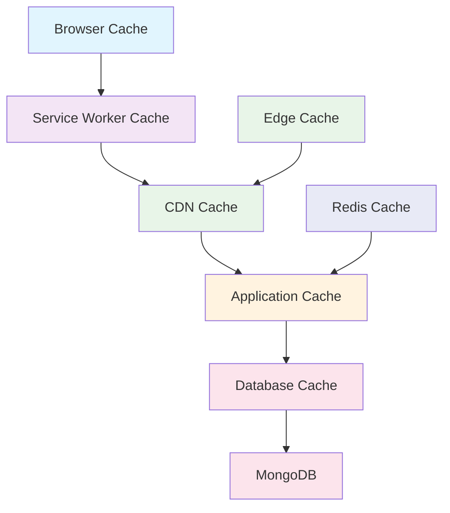

# ⚡ **Performance Optimization**

## *Complete Performance Strategy for Rotary Club Tunis Doyen CMS*

---

## 📋 **Performance Overview**

The Rotary Club Tunis Doyen CMS is optimized for the unique performance challenges of deploying in Tunisia, where users typically access the internet via 3G/4G connections with high latency and variable bandwidth. The performance strategy focuses on mobile-first optimization, progressive enhancement, and efficient resource delivery.

### **Performance Targets**

| Metric | Target | Tunisia Context |
|--------|--------|-----------------|
| **First Contentful Paint** | <1.5s | Critical for mobile users |
| **Largest Contentful Paint** | <2.5s | Optimized for 3G networks |
| **First Input Delay** | <100ms | Essential for interactivity |
| **Cumulative Layout Shift** | <0.1 | Prevents content jumping |
| **Bundle Size** | <200KB | Fits in single TCP packet |
| **Time to Interactive** | <3s | Mobile-first experience |

### **Key Performance Principles**

#### **1. Mobile-First Optimization**
- **Progressive Enhancement**: Core functionality works on basic mobile browsers
- **Lazy Loading**: Content loads as needed to reduce initial bundle size
- **Offline Capability**: Critical features work without internet connection
- **Touch Optimization**: 48px minimum touch targets for mobile devices

#### **2. Network Efficiency**
- **Compression**: Brotli and Gzip compression for all assets
- **Caching**: Multi-level caching strategy (CDN, browser, service worker)
- **Resource Hints**: Preload, prefetch, and preconnect for critical resources
- **Bundle Splitting**: Route-based and component-based code splitting

#### **3. Content Optimization**
- **Image Optimization**: WebP format with responsive sizing
- **Font Loading**: Optimized font delivery with fallbacks
- **Content Prioritization**: Above-the-fold content loads first
- **Arabic Text**: Optimized rendering for RTL content

#### **4. Database Performance**
- **Indexing Strategy**: Optimized queries for common access patterns
- **Connection Pooling**: Efficient database connection management
- **Query Optimization**: Aggregation pipelines for complex queries
- **Caching Layer**: Redis for frequently accessed data

---

## 🏗️ **Frontend Performance**

### **Bundle Optimization**

```javascript
// Next.js Configuration for Performance
const nextConfig = {
  // Bundle Analysis
  webpack: (config, { isServer }) => {
    if (!isServer) {
      config.optimization.splitChunks.chunks = 'all';
      config.optimization.splitChunks.cacheGroups = {
        vendor: {
          test: /[\\/]node_modules[\\/]/,
          name: 'vendors',
          chunks: 'all',
        },
        payload: {
          test: /[\\/]node_modules[\\/]payload[\\/]/,
          name: 'payload',
          chunks: 'all',
        },
        ui: {
          test: /[\\/]components[\\/]ui[\\/]/,
          name: 'ui-components',
          chunks: 'all',
        },
      };
    }
    return config;
  },

  // Image Optimization
  images: {
    formats: ['image/webp', 'image/avif'],
    deviceSizes: [640, 768, 1024, 1280, 1600],
    imageSizes: [16, 32, 48, 64, 96, 128, 256, 384],
    minimumCacheTTL: 60,
  },

  // Compression
  compress: true,
  poweredByHeader: false,

  // Headers for performance
  async headers() {
    return [
      {
        source: '/(.*)',
        headers: [
          { key: 'X-Frame-Options', value: 'DENY' },
          { key: 'X-Content-Type-Options', value: 'nosniff' },
          { key: 'Referrer-Policy', value: 'strict-origin-when-cross-origin' },
        ],
      },
    ];
  },
};
```

### **Critical Resource Loading**

```typescript
// Critical CSS Loading
const CriticalCSS = () => (
  <style dangerouslySetInnerHTML={{
    __html: `
      /* Critical above-the-fold styles */
      .hero { background: var(--rotary-red); }
      .nav { position: fixed; top: 0; }
      .btn-primary { background: var(--rotary-red); color: white; }
      .loading { opacity: 0.6; pointer-events: none; }

      /* Arabic RTL critical styles */
      [dir="rtl"] .text { text-align: right; }
      [dir="rtl"] .nav { flex-direction: row-reverse; }
    `
  }} />
);

// Font Loading Optimization
const FontLoader = () => (
  <>
    <link
      rel="preload"
      href="/fonts/inter.woff2"
      as="font"
      type="font/woff2"
      crossOrigin="anonymous"
    />
    <link
      rel="preload"
      href="/fonts/noto-naskh-arabic.woff2"
      as="font"
      type="font/woff2"
      crossOrigin="anonymous"
    />
    <style>
      {`
        @font-face {
          font-family: 'Inter';
          font-display: swap;
          src: url('/fonts/inter.woff2') format('woff2');
        }

        @font-face {
          font-family: 'Noto Naskh Arabic';
          font-display: swap;
          src: url('/fonts/noto-naskh-arabic.woff2') format('woff2');
        }
      `}
    </style>
  </>
);
```

### **Image Optimization Pipeline**

```typescript
// Next.js Image Component with Optimization
import Image from 'next/image';

const OptimizedImage = ({ src, alt, priority, sizes }) => (
  <Image
    src={src}
    alt={alt}
    priority={priority}
    sizes={sizes}
    placeholder="blur"
    blurDataURL="data:image/jpeg;base64,/9j/4AAQSkZJRgABAQAAAQ..."
    quality={85}
    loading="lazy"
    onLoadingComplete={() => {
      // Analytics tracking
      trackImageLoad(src);
    }}
  />
);

// Image Processing API Route
// pages/api/optimize-image.js
export default async function handler(req, res) {
  const { url, width, height, quality = 85 } = req.query;

  try {
    // Fetch original image
    const response = await fetch(url);
    const buffer = await response.arrayBuffer();

    // Process with Sharp
    const sharp = require('sharp');
    const optimized = await sharp(Buffer.from(buffer))
      .resize(width, height, {
        fit: 'cover',
        position: 'center'
      })
      .webp({ quality })
      .toBuffer();

    // Cache optimized image
    await cacheImage(url, width, height, optimized);

    res.setHeader('Content-Type', 'image/webp');
    res.setHeader('Cache-Control', 'public, max-age=31536000');
    res.send(optimized);

  } catch (error) {
    console.error('Image optimization failed:', error);
    res.status(500).json({ error: 'Optimization failed' });
  }
}
```

### **Service Worker for Offline Support**

```typescript
// public/sw.js
const CACHE_NAME = 'rotary-cms-v1';
const STATIC_CACHE = 'rotary-static-v1';
const API_CACHE = 'rotary-api-v1';

const STATIC_ASSETS = [
  '/',
  '/offline',
  '/manifest.json',
  '/fonts/inter.woff2',
  '/fonts/noto-naskh-arabic.woff2',
  '/images/logo.webp'
];

self.addEventListener('install', (event) => {
  event.waitUntil(
    caches.open(STATIC_CACHE).then(cache => {
      return cache.addAll(STATIC_ASSETS);
    })
  );
});

self.addEventListener('fetch', (event) => {
  const { request } = event;
  const url = new URL(request.url);

  // Cache API responses for events and media
  if (url.pathname.startsWith('/api/')) {
    event.respondWith(cacheFirst(request, API_CACHE));
    return;
  }

  // Cache static assets
  if (STATIC_ASSETS.some(asset => url.pathname.endsWith(asset))) {
    event.respondWith(cacheFirst(request, STATIC_CACHE));
    return;
  }

  // Network first for dynamic content
  event.respondWith(networkFirst(request));
});

async function cacheFirst(request, cacheName) {
  const cached = await caches.match(request);
  if (cached) return cached;

  try {
    const response = await fetch(request);
    if (response.ok) {
      const cache = await caches.open(cacheName);
      cache.put(request, response.clone());
    }
    return response;
  } catch (error) {
    return caches.match('/offline');
  }
}

async function networkFirst(request) {
  try {
    const response = await fetch(request);
    if (response.ok) {
      const cache = await caches.open(API_CACHE);
      cache.put(request, response.clone());
    }
    return response;
  } catch (error) {
    const cached = await caches.match(request);
    return cached || caches.match('/offline');
  }
}
```

---

## 🔌 **Backend Performance**

### **Database Optimization**

```javascript
// Optimized MongoDB Indexes
db.events.createIndex({ status: 1, eventDate: -1 });
db.events.createIndex({ areasOfFocus: 1 });
db.events.createIndex({ createdBy: 1 });
db.events.createIndex({
  'title.fr': 'text',
  'title.ar': 'text',
  'description.fr': 'text',
  'description.ar': 'text'
}, {
  weights: {
    'title.fr': 10,
    'title.ar': 10,
    'description.fr': 5,
    'description.ar': 5
  }
});

db.media.createIndex({ consentObtained: 1, createdAt: -1 });
db.media.createIndex({ mimeType: 1 });

db.users.createIndex({ email: 1 }, { unique: true });
db.users.createIndex({ role: 1 });

db.audit_logs.createIndex({ timestamp: -1 });
db.audit_logs.createIndex({ userId: 1, timestamp: -1 });
```

### **Query Optimization Patterns**

```javascript
// Optimized Event Query with Aggregation
const getEventsWithImpact = async (locale = 'fr', page = 1, limit = 10) => {
  const skip = (page - 1) * limit;

  return await db.collection('events').aggregate([
    {
      $match: {
        status: 'published',
        [`title.${locale}`]: { $exists: true, $ne: '' }
      }
    },
    {
      $lookup: {
        from: 'media',
        localField: 'gallery.image',
        foreignField: '_id',
        as: 'mediaDetails'
      }
    },
    {
      $project: {
        title: `$title.${locale}`,
        description: `$description.${locale}`,
        eventDate: 1,
        location: `$location.${locale}`,
        areasOfFocus: 1,
        impactMetrics: 1,
        mediaCount: { $size: '$gallery' },
        createdAt: 1,
        // Calculate reading time estimate
        readingTime: {
          $divide: [
            { $strLenCP: `$description.${locale}` },
            200 // Average reading speed
          ]
        }
      }
    },
    {
      $sort: { eventDate: -1 }
    },
    {
      $skip: skip
    },
    {
      $limit: limit
    }
  ]);
};

// Cached Query with Redis
const getCachedEvents = async (locale, page, limit) => {
  const cacheKey = `events:${locale}:${page}:${limit}`;

  // Try Redis cache first
  const cached = await redis.get(cacheKey);
  if (cached) {
    return JSON.parse(cached);
  }

  // Fetch from database
  const events = await getEventsWithImpact(locale, page, limit);

  // Cache for 5 minutes
  await redis.setex(cacheKey, 300, JSON.stringify(events));

  return events;
};
```

### **API Response Optimization**

```typescript
// Optimized API Response with Compression
const createOptimizedResponse = (data: any, locale: string) => {
  // Remove unnecessary fields for mobile
  const optimized = {
    ...data,
    // Strip out fields not needed on mobile
    _id: undefined,
    createdAt: undefined,
    updatedAt: undefined,
    // Keep only localized content
    title: data.title?.[locale],
    description: data.description?.[locale],
    location: data.location?.[locale]
  };

  return optimized;
};

// Streaming Response for Large Datasets
const streamEventsResponse = async (res, locale, filters) => {
  res.setHeader('Content-Type', 'application/json');
  res.setHeader('Transfer-Encoding', 'chunked');

  res.write('{"docs":[');

  let first = true;
  const cursor = db.collection('events').find(filters);

  while (await cursor.hasNext()) {
    const event = await cursor.next();
    const optimized = createOptimizedResponse(event, locale);

    if (!first) res.write(',');
    res.write(JSON.stringify(optimized));
    first = false;
  }

  res.write(']}');
  res.end();
};
```

---

## 📱 **Mobile Performance**

### **Mobile-Specific Optimizations**

```typescript
// Mobile Detection and Optimization
const isMobile = (userAgent: string): boolean => {
  return /Android|webOS|iPhone|iPad|iPod|BlackBerry|IEMobile|Opera Mini/i.test(userAgent);
};

const getMobileOptimizedConfig = (isMobileDevice: boolean) => {
  if (isMobileDevice) {
    return {
      // Smaller images for mobile
      imageSizes: [320, 640, 768],
      // Reduced content for slower connections
      contentLimit: 5,
      // Enable offline mode
      offlineEnabled: true,
      // Touch-friendly interactions
      touchTargets: true
    };
  }

  return {
    imageSizes: [1024, 1280, 1600],
    contentLimit: 10,
    offlineEnabled: false,
    touchTargets: false
  };
};
```

### **Progressive Web App (PWA) Features**

```typescript
// manifest.json
{
  "name": "Rotary Club Tunis Doyen CMS",
  "short_name": "Rotary CMS",
  "description": "Trilingual content management for Rotary volunteers",
  "start_url": "/",
  "display": "standalone",
  "background_color": "#ffffff",
  "theme_color": "#E31837",
  "orientation": "portrait-primary",
  "categories": ["business", "productivity"],
  "lang": "fr",
  "dir": "ltr",
  "icons": [
    {
      "src": "/icons/icon-192x192.png",
      "sizes": "192x192",
      "type": "image/png",
      "purpose": "any maskable"
    },
    {
      "src": "/icons/icon-512x512.png",
      "sizes": "512x512",
      "type": "image/png",
      "purpose": "any maskable"
    }
  ],
  "screenshots": [
    {
      "src": "/screenshots/mobile-dashboard.png",
      "sizes": "390x844",
      "type": "image/png",
      "form_factor": "narrow"
    }
  ]
}
```

### **Critical CSS and Above-the-Fold Loading**

```css
/* Critical CSS for Mobile */
.critical-mobile {
  /* Layout */
  .container { max-width: 100%; padding: 1rem; }
  .nav { position: fixed; top: 0; width: 100%; z-index: 1000; }

  /* Typography */
  .heading { font-size: 1.5rem; line-height: 1.3; }
  .body { font-size: 1rem; line-height: 1.6; }

  /* Interactive Elements */
  .btn { min-height: 48px; padding: 0.75rem 1rem; }
  .input { min-height: 48px; padding: 0.75rem; }

  /* Arabic RTL */
  [dir="rtl"] .text { text-align: right; direction: rtl; }
  [dir="rtl"] .btn-group { flex-direction: row-reverse; }

  /* Loading States */
  .skeleton { background: linear-gradient(90deg, #f0f0f0 25%, #e0e0e0 50%, #f0f0f0 75%); }
  .skeleton { animation: loading 1.5s infinite; }
}

@keyframes loading {
  0% { background-position: -200px 0; }
  100% { background-position: calc(200px + 100%) 0; }
}
```

---

## 📊 **Caching Strategy**

### **Multi-Level Caching Architecture**



### **Cache Configuration**

```typescript
// Redis Cache Configuration
const cacheConfig = {
  // Event data cache
  events: {
    ttl: 300, // 5 minutes
    keyPattern: 'events:{locale}:{page}:{limit}:{filters}',
    invalidation: ['event:create', 'event:update', 'event:delete']
  },

  // Media metadata cache
  media: {
    ttl: 3600, // 1 hour
    keyPattern: 'media:{id}:meta',
    invalidation: ['media:create', 'media:update', 'media:delete']
  },

  // User session cache
  session: {
    ttl: 604800, // 7 days
    keyPattern: 'session:{userId}',
    invalidation: ['user:logout', 'session:expire']
  },

  // API response cache
  api: {
    ttl: 180, // 3 minutes
    keyPattern: 'api:{endpoint}:{params}',
    invalidation: ['content:change']
  }
};

// Cache Invalidation Strategy
const invalidateCache = async (pattern: string, keys: string[]) => {
  const redis = new Redis(process.env.REDIS_URL);

  if (pattern.includes('*')) {
    // Pattern-based invalidation
    const keys = await redis.keys(pattern);
    if (keys.length > 0) {
      await redis.del(...keys);
    }
  } else {
    // Specific key invalidation
    await redis.del(...keys);
  }
};
```

### **Edge Caching with Vercel**

```typescript
// Vercel Edge Configuration
export const config = {
  runtime: 'edge',
};

export default async function handler(request: Request) {
  const url = new URL(request.url);
  const cacheKey = url.pathname + url.search;

  // Check edge cache
  const cached = await caches.default.match(cacheKey);
  if (cached) {
    return cached;
  }

  // Fetch from origin
  const response = await fetch(request);

  // Cache successful responses
  if (response.ok) {
    const cacheResponse = response.clone();
    cacheResponse.headers.set('Cache-Control', 'public, max-age=300');
    await caches.default.put(cacheKey, cacheResponse);
  }

  return response;
}
```

---

## 📈 **Monitoring & Analytics**

### **Performance Monitoring**

```typescript
// Web Vitals Tracking
import { getCLS, getFID, getFCP, getLCP, getTTFB } from 'web-vitals';

const reportWebVitals = (metric) => {
  // Send to analytics service
  fetch('/api/analytics/performance', {
    method: 'POST',
    headers: { 'Content-Type': 'application/json' },
    body: JSON.stringify({
      metric: metric.name,
      value: metric.value,
      id: metric.id,
      timestamp: Date.now(),
      userAgent: navigator.userAgent,
      connection: navigator.connection?.effectiveType
    })
  });
};

// Initialize tracking
getCLS(reportWebVitals);
getFID(reportWebVitals);
getFCP(reportWebVitals);
getLCP(reportWebVitals);
getTTFB(reportWebVitals);
```

### **Real User Monitoring (RUM)**

```typescript
// Performance Observer for Long Tasks
const observeLongTasks = () => {
  const observer = new PerformanceObserver((list) => {
    for (const entry of list.getEntries()) {
      if (entry.duration > 50) { // Tasks longer than 50ms
        trackLongTask({
          duration: entry.duration,
          startTime: entry.startTime,
          name: entry.name
        });
      }
    }
  });

  observer.observe({ entryTypes: ['longtask'] });
};

// Network Request Monitoring
const observeNetworkRequests = () => {
  const observer = new PerformanceObserver((list) => {
    for (const entry of list.getEntries()) {
      trackNetworkRequest({
        url: entry.name,
        duration: entry.duration,
        size: entry.transferSize,
        type: entry.initiatorType
      });
    }
  });

  observer.observe({ entryTypes: ['resource'] });
};
```

### **Performance Budgets**

```javascript
// Performance Budget Configuration
const performanceBudget = {
  // Bundle size limits
  bundles: {
    'main.js': '200kb',
    'vendor.js': '300kb',
    'styles.css': '50kb'
  },

  // Resource size limits
  resources: {
    images: '2mb',
    fonts: '100kb',
    scripts: '500kb'
  },

  // Timing limits
  timings: {
    firstContentfulPaint: '1500ms',
    largestContentfulPaint: '2500ms',
    firstInputDelay: '100ms',
    cumulativeLayoutShift: '0.1'
  }
};

// Automated Budget Checking
const checkPerformanceBudget = async () => {
  const bundleAnalyzer = require('webpack-bundle-analyzer');

  // Analyze bundle sizes
  const stats = await bundleAnalyzer.generateStats();

  for (const [bundle, limit] of Object.entries(performanceBudget.bundles)) {
    const size = stats.assets.find(asset => asset.name === bundle)?.size;
    if (size > parseSize(limit)) {
      throw new Error(`Bundle ${bundle} exceeds budget: ${size} > ${limit}`);
    }
  }
};
```

---

## 🔧 **Optimization Tools & Techniques**

### **Build Optimization**

```javascript
// Webpack Configuration for Performance
const webpackConfig = {
  mode: 'production',
  optimization: {
    splitChunks: {
      chunks: 'all',
      cacheGroups: {
        vendor: {
          test: /[\\/]node_modules[\\/]/,
          name: 'vendors',
          chunks: 'all',
          enforce: true
        },
        payload: {
          test: /[\\/]node_modules[\\/]payload[\\/]/,
          name: 'payload-vendor',
          chunks: 'all',
          enforce: true
        }
      }
    },
    minimize: true,
    minimizer: [
      new TerserPlugin({
        terserOptions: {
          compress: {
            drop_console: true,
            drop_debugger: true
          }
        }
      }),
      new CssMinimizerPlugin()
    ]
  }
};
```

### **Content Delivery Optimization**

```typescript
// CDN Configuration for Tunisia
const cdnConfig = {
  // Primary CDN (Vercel)
  primary: {
    domain: 'rotary-tunis-doyen.vercel.app',
    regions: ['fra1', 'cdg1', 'lhr1'], // European edge locations
    cache: {
      static: '1y',
      api: '5m',
      images: '1h'
    }
  },

  // Fallback CDN (Cloudflare)
  fallback: {
    domain: 'rotary-tunis.cloudflare.net',
    regions: ['global'],
    cache: {
      static: '1y',
      api: '1m',
      images: '1h'
    }
  }
};
```

### **Database Connection Optimization**

```javascript
// MongoDB Connection Pool Configuration
const mongooseConfig = {
  maxPoolSize: 10, // Maximum number of connections
  minPoolSize: 2,  // Minimum number of connections
  maxIdleTimeMS: 30000, // Close connections after 30s of inactivity
  serverSelectionTimeoutMS: 5000, // Timeout for server selection
  socketTimeoutMS: 45000, // Close sockets after 45s of inactivity
  bufferMaxEntries: 0, // Disable mongoose buffering
  bufferCommands: false, // Disable mongoose buffering
  retryWrites: true, // Retry failed writes
  retryReads: true, // Retry failed reads
  readPreference: 'secondaryPreferred' // Read from secondary if available
};
```

---

## 📊 **Performance Testing**

### **Load Testing Strategy**

```typescript
// K6 Load Testing Script
import http from 'k6/http';
import { check, sleep } from 'k6';

export const options = {
  scenarios: {
    constant_load: {
      executor: 'constant-vus',
      vus: 50,
      duration: '5m',
      tags: { test_type: 'constant_load' }
    },
    spike_test: {
      executor: 'ramping-vus',
      startVUs: 0,
      stages: [
        { duration: '1m', target: 100 },
        { duration: '1m', target: 100 },
        { duration: '1m', target: 0 }
      ],
      tags: { test_type: 'spike_test' }
    }
  },
  thresholds: {
    http_req_duration: ['p(95)<500'],
    http_req_failed: ['rate<0.1']
  }
};

export default function () {
  // Test event listing
  const eventsResponse = http.get('https://rotary-tunis-doyen.vercel.app/api/events');
  check(eventsResponse, {
    'events status is 200': (r) => r.status === 200,
    'events response time < 500ms': (r) => r.timings.duration < 500,
    'events has docs array': (r) => JSON.parse(r.body).docs !== undefined
  });

  // Test media upload
  const mediaData = { file: http.file('test-image.jpg', 'test-image.jpg') };
  const mediaResponse = http.post(
    'https://rotary-tunis-doyen.vercel.app/api/media',
    mediaData,
    {
      headers: {
        'Authorization': 'Bearer test-token',
        'Content-Type': 'multipart/form-data'
      }
    }
  );

  sleep(1);
}
```

### **Automated Performance Monitoring**

```typescript
// Continuous Performance Monitoring
const performanceMonitor = {
  // Core Web Vitals monitoring
  webVitals: async (metrics) => {
    await fetch('/api/analytics/web-vitals', {
      method: 'POST',
      headers: { 'Content-Type': 'application/json' },
      body: JSON.stringify(metrics)
    });
  },

  // API performance monitoring
  apiPerformance: async (endpoint, duration, status) => {
    await fetch('/api/analytics/api-performance', {
      method: 'POST',
      headers: { 'Content-Type': 'application/json' },
      body: JSON.stringify({
        endpoint,
        duration,
        status,
        timestamp: Date.now(),
        userAgent: navigator.userAgent
      })
    });
  },

  // Database performance monitoring
  databasePerformance: async (query, duration, success) => {
    await fetch('/api/analytics/database-performance', {
      method: 'POST',
      headers: { 'Content-Type': 'application/json' },
      body: JSON.stringify({
        query: query.substring(0, 100), // First 100 chars
        duration,
        success,
        timestamp: Date.now()
      })
    });
  }
};
```

---

## 🔗 **Cross-References**

### **Related Documentation**
- **[`Technical-Specification-Hub.md`](Technical-Specification-Hub.md)**: Main technical reference
- **[`System-Architecture-Overview.md`](System-Architecture-Overview.md)**: Architecture details
- **[`Database-Schema-Design.md`](Database-Schema-Design.md)**: Database optimization
- **[`UI-UX-Design-Principles.md`](UI-UX-Design-Principles.md)**: Frontend performance
- **[`Security-Protocols.md`](Security-Protocols.md)**: Security performance impact

### **External Resources**
- [Web Performance Best Practices](https://web.dev/performance/)
- [Core Web Vitals](https://web.dev/vitals/)
- [MongoDB Performance Optimization](https://docs.mongodb.com/manual/performance/)
- [Next.js Performance](https://nextjs.org/docs/advanced-features/performance)

---

*This performance optimization document provides comprehensive strategies for achieving excellent performance in the Rotary Club Tunis Doyen CMS, specifically tailored for Tunisia's network conditions and mobile-first usage patterns. Last updated: August 2025.*