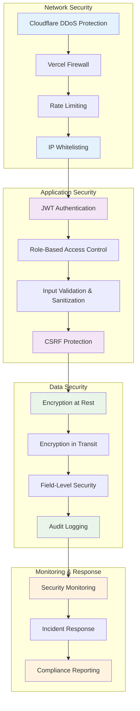
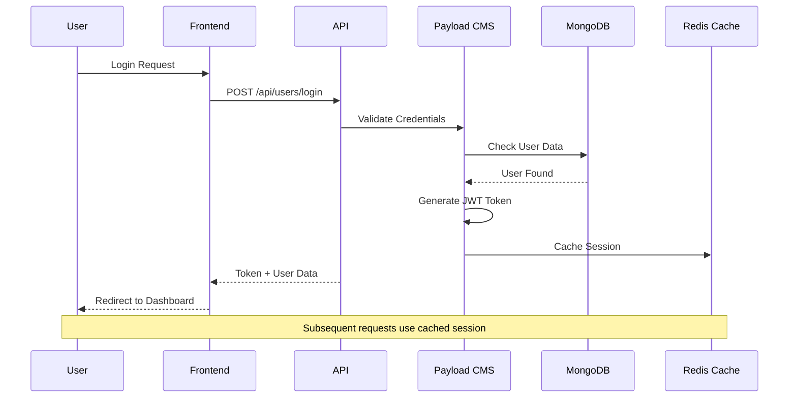

# 🔒 **Security Protocols**

## *Comprehensive Security Framework for Rotary Club Tunis Doyen CMS*

---

## 📋 **Security Overview**

The Rotary Club Tunis Doyen CMS implements a multi-layered security approach designed to protect sensitive volunteer data, ensure GDPR compliance, and maintain system integrity. The security framework addresses the unique challenges of deploying in Tunisia, including variable network conditions and the need for Arabic content protection.

### **Security Principles**

#### **1. Defense in Depth**
- **Multiple Security Layers**: Network, application, and data security
- **Fail-Safe Defaults**: Secure by default, explicit permissions required
- **Zero Trust Architecture**: Never trust, always verify
- **Least Privilege**: Minimum permissions for maximum security

#### **2. Privacy by Design**
- **Data Minimization**: Collect only necessary data
- **Purpose Limitation**: Use data only for stated purposes
- **Storage Limitation**: Retain data only as long as needed
- **GDPR Compliance**: Full compliance with European data protection laws

#### **3. Cultural Security Awareness**
- **Arabic Content Protection**: Secure handling of RTL text and Arabic metadata
- **Cultural Sensitivity**: Respect for Islamic and Tunisian cultural norms
- **Local Threat Landscape**: Protection against regional cyber threats
- **Community Trust**: Building confidence through transparent security practices

---

## 🏗️ **Security Architecture**

### **Security Layers**



### **Authentication Architecture**



---

## 🔐 **Authentication & Authorization**

### **JWT Implementation**

```typescript
// JWT Configuration
const jwtConfig = {
  secret: process.env.JWT_SECRET, // 32+ character random string
  expiresIn: '7d', // 7 days for Tunisia's network conditions
  issuer: 'rotary-tunis-doyen-cms',
  audience: ['rotary-tunis-doyen.vercel.app'],
  algorithms: ['HS256']
};

// Token Payload Structure
interface JWTPayload {
  id: string;
  email: string;
  name: string;
  role: 'volunteer' | 'editor' | 'admin';
  languagePreference: 'fr' | 'ar' | 'en';
  iat: number;
  exp: number;
  iss: string;
  aud: string[];
}

// Token Generation
const generateToken = (user: User): string => {
  const payload: JWTPayload = {
    id: user.id,
    email: user.email,
    name: user.name,
    role: user.role,
    languagePreference: user.languagePreference,
    iat: Math.floor(Date.now() / 1000),
    exp: Math.floor(Date.now() / 1000) + (7 * 24 * 60 * 60), // 7 days
    iss: jwtConfig.issuer,
    aud: jwtConfig.audience
  };

  return jwt.sign(payload, jwtConfig.secret, {
    algorithm: jwtConfig.algorithms[0]
  });
};
```

### **Role-Based Access Control (RBAC)**

```typescript
// Access Control Configuration
const accessControl = {
  // Collection-level permissions
  events: {
    read: () => true, // Public read access
    create: ({ req }) => ['volunteer', 'editor', 'admin'].includes(req.user.role),
    update: ({ req, doc }) => {
      if (req.user.role === 'admin') return true;
      if (req.user.role === 'editor') return true;
      return { createdBy: { equals: req.user.id } };
    },
    delete: ({ req }) => req.user.role === 'admin'
  },

  media: {
    read: () => true,
    create: ({ req }) => ['volunteer', 'editor', 'admin'].includes(req.user.role),
    update: ({ req, doc }) => {
      if (req.user.role === 'admin') return true;
      return { createdBy: { equals: req.user.id } };
    },
    delete: ({ req }) => req.user.role === 'admin'
  },

  users: {
    read: ({ req }) => {
      if (req.user.role === 'admin') return true;
      return { id: { equals: req.user.id } };
    },
    create: ({ req }) => req.user.role === 'admin',
    update: ({ req }) => {
      if (req.user.role === 'admin') return true;
      return { id: { equals: req.user.id } };
    },
    delete: ({ req }) => req.user.role === 'admin'
  },

  minutes: {
    read: ({ req }) => req.user.role === 'admin',
    create: ({ req }) => req.user.role === 'admin',
    update: ({ req }) => req.user.role === 'admin',
    delete: ({ req }) => req.user.role === 'admin'
  }
};
```

### **Password Security**

```typescript
// Password Policy
const passwordPolicy = {
  minLength: 8,
  maxLength: 128,
  requireUppercase: true,
  requireLowercase: true,
  requireNumbers: true,
  requireSpecialChars: false, // Simplified for volunteers
  preventCommonPasswords: true,
  preventPersonalInfo: true
};

// Password Hashing
const hashPassword = async (password: string): Promise<string> => {
  const saltRounds = 12; // Increased for security
  const salt = await bcrypt.genSalt(saltRounds);
  return bcrypt.hash(password, salt);
};

// Password Validation
const validatePassword = (password: string, userData: any): boolean => {
  // Check length
  if (password.length < passwordPolicy.minLength) return false;

  // Check complexity
  if (passwordPolicy.requireUppercase && !/[A-Z]/.test(password)) return false;
  if (passwordPolicy.requireLowercase && !/[a-z]/.test(password)) return false;
  if (passwordPolicy.requireNumbers && !/\d/.test(password)) return false;

  // Check against common passwords
  if (commonPasswords.includes(password.toLowerCase())) return false;

  // Check against personal information
  const personalInfo = [
    userData.name?.toLowerCase(),
    userData.email?.toLowerCase(),
    'rotary', 'tunis', 'doyen'
  ];

  for (const info of personalInfo) {
    if (info && password.toLowerCase().includes(info)) return false;
  }

  return true;
};
```

---

## 🛡️ **Data Protection**

### **Encryption Strategy**

```typescript
// Client-Side Encryption for Media
const encryptMedia = async (fileBuffer: Buffer, key: string): Promise<Buffer> => {
  const algorithm = 'aes-256-gcm';
  const iv = crypto.randomBytes(16);
  const cipher = crypto.createCipher(algorithm, key);

  const encrypted = Buffer.concat([
    cipher.update(fileBuffer),
    cipher.final()
  ]);

  const authTag = cipher.getAuthTag();

  // Return encrypted data with IV and auth tag
  return Buffer.concat([iv, authTag, encrypted]);
};

// Database Field Encryption
const encryptField = (text: string, key: string): string => {
  const algorithm = 'aes-256-cbc';
  const iv = crypto.randomBytes(16);
  const cipher = crypto.createCipheriv(algorithm, key, iv);

  let encrypted = cipher.update(text, 'utf8', 'hex');
  encrypted += cipher.final('hex');

  return iv.toString('hex') + ':' + encrypted;
};

// Key Management
const keyManagement = {
  // Master encryption key (stored in environment)
  masterKey: process.env.ENCRYPTION_MASTER_KEY,

  // Per-user keys for additional security
  generateUserKey: (userId: string): string => {
    return crypto.scryptSync(
      userId + process.env.USER_KEY_SALT,
      process.env.USER_KEY_SALT,
      32
    ).toString('hex');
  },

  // Key rotation
  rotateKeys: async () => {
    // Re-encrypt all data with new keys
    // Update environment variables
    // Schedule downtime for rotation
  }
};
```

### **GDPR Compliance Framework**

```typescript
// Data Subject Rights Implementation
const gdprCompliance = {
  // Right to Access
  exportUserData: async (userId: string) => {
    const user = await payload.findByID({ collection: 'users', id: userId });
    const events = await payload.find({
      collection: 'events',
      where: { createdBy: { equals: userId } }
    });
    const media = await payload.find({
      collection: 'media',
      where: { createdBy: { equals: userId } }
    });

    return {
      user: {
        id: user.id,
        email: user.email,
        name: user.name,
        role: user.role,
        languagePreference: user.languagePreference,
        createdAt: user.createdAt,
        lastLogin: user.lastLogin
      },
      events: events.docs,
      media: media.docs,
      auditLog: await getUserAuditLog(userId),
      consentRecords: await getUserConsents(userId)
    };
  },

  // Right to Erasure
  deleteUserData: async (userId: string) => {
    // Anonymize user data
    await payload.update({
      collection: 'users',
      id: userId,
      data: {
        name: 'Deleted User',
        email: `deleted.${userId}@anonymous.local`,
        password: null,
        lastLogin: null
      }
    });

    // Delete or anonymize related content
    await payload.updateMany({
      collection: 'events',
      where: { createdBy: { equals: userId } },
      data: { createdBy: null, status: 'archived' }
    });

    // Log deletion
    await auditLog({
      action: 'delete',
      collection: 'users',
      documentId: userId,
      reason: 'GDPR right to erasure'
    });
  },

  // Consent Management
  manageConsent: async (userId: string, consentType: string, consented: boolean) => {
    await payload.create({
      collection: 'consent-records',
      data: {
        userId,
        consentType, // 'media', 'data-processing', 'marketing'
        consented,
        timestamp: new Date(),
        ipAddress: getClientIP(),
        userAgent: getUserAgent()
      }
    });
  }
};
```

### **Data Retention Policies**

```typescript
// Retention Policy Configuration
const retentionPolicies = {
  // User data
  users: {
    active: 'indefinite', // Keep while user is active
    inactive: '7 years', // After account deletion
    auditLogs: '10 years' // Legal requirement
  },

  // Content data
  events: {
    published: 'indefinite', // Keep published content
    drafts: '1 year', // Delete old drafts
    archived: '5 years' // Keep archived content
  },

  // Media data
  media: {
    withConsent: 'indefinite', // Keep with valid consent
    withoutConsent: '30 days', // Delete if no consent
    thumbnails: '1 year' // Cache cleanup
  },

  // System data
  auditLogs: '10 years', // Legal requirement
  backups: '30 days', // Operational backups
  analytics: '2 years' // Performance data
};

// Automated Cleanup Jobs
const cleanupJobs = {
  // Daily cleanup
  daily: async () => {
    // Delete expired sessions
    // Clean temporary files
    // Remove old cache entries
  },

  // Weekly cleanup
  weekly: async () => {
    // Delete old draft content
    // Compress old log files
    // Update search indexes
  },

  // Monthly cleanup
  monthly: async () => {
    // Review and delete old backups
    // Analyze storage usage
    // Generate retention reports
  }
};
```

---

##  **Threat Protection**

### **Network Security**

```typescript
// Rate Limiting Configuration
const rateLimitConfig = {
  windowMs: 15 * 60 * 1000, // 15 minutes
  max: 100, // Limit each IP to 100 requests per window
  message: {
    error: 'RATE_LIMIT_EXCEEDED',
    message: 'Too many requests from this IP, please try again later.'
  },
  standardHeaders: true,
  legacyHeaders: false,

  // Skip rate limiting for certain paths
  skip: (req) => {
    const publicPaths = ['/api/events', '/api/media'];
    return publicPaths.some(path => req.path.startsWith(path));
  },

  // Custom key generator
  keyGenerator: (req) => {
    // Use IP + User Agent for better identification
    return req.ip + ':' + req.get('User-Agent');
  }
};

// DDoS Protection Headers
const securityHeaders = {
  'X-Frame-Options': 'DENY',
  'X-Content-Type-Options': 'nosniff',
  'X-XSS-Protection': '1; mode=block',
  'Strict-Transport-Security': 'max-age=31536000; includeSubDomains',
  'Content-Security-Policy': "default-src 'self'",
  'Referrer-Policy': 'strict-origin-when-cross-origin',
  'Permissions-Policy': 'geolocation=(), microphone=(), camera=()'
};
```

### **Input Validation & Sanitization**

```typescript
// Input Validation Schema
const validationSchemas = {
  event: {
    title: yup.object({
      fr: yup.string().required().min(3).max(200),
      ar: yup.string().min(3).max(200),
      en: yup.string().min(3).max(200)
    }),
    eventDate: yup.date().required().min(new Date()),
    location: yup.object({
      fr: yup.string().required().min(3).max(200),
      ar: yup.string().min(3).max(200),
      en: yup.string().min(3).max(200)
    }),
    description: yup.object({
      fr: yup.string().required().min(10).max(5000),
      ar: yup.string().min(10).max(5000),
      en: yup.string().min(10).max(5000)
    })
  },

  media: {
    altText: yup.object({
      fr: yup.string().required().min(3).max(500),
      ar: yup.string().required().min(3).max(500),
      en: yup.string().min(3).max(500)
    }),
    consentObtained: yup.boolean().required().oneOf([true]),
    filename: yup.string().matches(/^[^<>:;,?"*|/\\]+$/)
  },

  user: {
    email: yup.string().email().required(),
    name: yup.string().required().min(2).max(100),
    password: yup.string().matches(
      /^(?=.*[a-z])(?=.*[A-Z])(?=.*\d)[a-zA-Z\d@$!%*?&]{8,}$/
    )
  }
};

// Content Sanitization
const sanitizeContent = (content: string): string => {
  // Remove potentially dangerous HTML
  const allowedTags = [
    'p', 'br', 'strong', 'em', 'u', 'h1', 'h2', 'h3',
    'ul', 'ol', 'li', 'a', 'img', 'blockquote'
  ];

  const allowedAttributes = {
    'a': ['href', 'target'],
    'img': ['src', 'alt', 'width', 'height']
  };

  return sanitizeHtml(content, {
    allowedTags,
    allowedAttributes,
    allowedSchemes: ['http', 'https', 'mailto'],
    transformTags: {
      'a': (tagName, attribs) => {
        // Ensure external links open in new tab
        if (attribs.href && !attribs.href.startsWith('/')) {
          attribs.target = '_blank';
          attribs.rel = 'noopener noreferrer';
        }
        return { tagName, attribs };
      }
    }
  });
};
```

### **File Upload Security**

```typescript
// File Upload Validation
const validateFileUpload = (file: UploadedFile): boolean => {
  // File size limits
  const maxSizes = {
    image: 5 * 1024 * 1024, // 5MB
    document: 10 * 1024 * 1024, // 10MB
    video: 50 * 1024 * 1024 // 50MB
  };

  if (file.size > maxSizes[file.type]) return false;

  // Allowed MIME types
  const allowedTypes = [
    'image/jpeg', 'image/png', 'image/webp', 'image/gif',
    'application/pdf', 'text/plain',
    'video/mp4', 'video/webm'
  ];

  if (!allowedTypes.includes(file.mimetype)) return false;

  // File name validation
  const dangerousPatterns = /[<>:"|?*\x00-\x1f]/;
  if (dangerousPatterns.test(file.originalname)) return false;

  return true;
};

// Virus Scanning Integration
const scanFile = async (fileBuffer: Buffer): Promise<boolean> => {
  // Integration with virus scanning service
  // This is a placeholder for actual implementation
  const scanResult = await virusScanner.scan(fileBuffer);

  return scanResult.clean;
};
```

---

## 📊 **Audit & Monitoring**

### **Comprehensive Audit Logging**

```typescript
// Audit Log Schema
interface AuditLog {
  id: string;
  timestamp: Date;
  userId: string;
  userEmail: string;
  userRole: string;
  action: 'create' | 'update' | 'delete' | 'login' | 'logout' | 'export';
  collection: string;
  documentId: string;
  changes: {
    before?: any;
    after?: any;
    fields?: string[];
  };
  ipAddress: string;
  userAgent: string;
  sessionId: string;
  success: boolean;
  error?: string;
  metadata?: Record<string, any>;
}

// Audit Logging Function
const auditLog = async (logData: Omit<AuditLog, 'id' | 'timestamp'>) => {
  try {
    await payload.create({
      collection: 'audit-logs',
      data: {
        ...logData,
        timestamp: new Date()
      }
    });
  } catch (error) {
    // Log audit failure to console as fallback
    console.error('Audit log failed:', error);
  }
};

// Automatic Audit Logging Hook
const auditHook = async ({ req, operation, doc, previousDoc }) => {
  if (!req.user) return doc; // Skip for unauthenticated requests

  const changes = {
    before: previousDoc,
    after: doc,
    fields: []
  };

  // Identify changed fields
  if (previousDoc && doc) {
    changes.fields = Object.keys(doc).filter(
      key => JSON.stringify(doc[key]) !== JSON.stringify(previousDoc[key])
    );
  }

  await auditLog({
    userId: req.user.id,
    userEmail: req.user.email,
    userRole: req.user.role,
    action: operation,
    collection: req.collection.config.slug,
    documentId: doc.id,
    changes,
    ipAddress: req.ip,
    userAgent: req.headers['user-agent'],
    sessionId: req.session?.id,
    success: true
  });

  return doc;
};
```

### **Security Monitoring Dashboard**

```typescript
// Security Metrics Collection
const securityMetrics = {
  // Authentication metrics
  authFailures: async () => {
    return await payload.find({
      collection: 'audit-logs',
      where: {
        action: { equals: 'login' },
        success: { equals: false }
      },
      limit: 0
    });
  },

  // Suspicious activity detection
  suspiciousActivity: async () => {
    const recentLogs = await payload.find({
      collection: 'audit-logs',
      where: {
        timestamp: { greater_than: new Date(Date.now() - 24 * 60 * 60 * 1000) }
      },
      sort: '-timestamp'
    });

    return recentLogs.docs.filter(log => {
      // Multiple failed logins from same IP
      // Unusual access patterns
      // Large data exports
      // Administrative actions by non-admins
      return detectSuspiciousPattern(log);
    });
  },

  // GDPR compliance metrics
  gdprCompliance: async () => {
    const consentRecords = await payload.find({
      collection: 'consent-records',
      where: {
        timestamp: { greater_than: new Date(Date.now() - 30 * 24 * 60 * 60 * 1000) }
      }
    });

    return {
      totalConsents: consentRecords.totalDocs,
      consentByType: groupBy(consentRecords.docs, 'consentType'),
      expiredConsents: consentRecords.docs.filter(c => isExpired(c))
    };
  }
};
```

### **Incident Response Plan**

```typescript
// Incident Response Workflow
const incidentResponse = {
  // 1. Detection
  detect: (event) => {
    // Monitor for security events
    // Alert on suspicious patterns
    // Automated threat detection
  },

  // 2. Assessment
  assess: async (incident) => {
    // Determine impact and scope
    // Identify affected systems/data
    // Assess business impact
    return {
      severity: 'low|medium|high|critical',
      affectedUsers: number,
      dataExposed: boolean,
      systemCompromised: boolean
    };
  },

  // 3. Response
  respond: async (incident, assessment) => {
    // Contain the incident
    // Notify affected parties
    // Activate response team
    // Implement temporary measures
  },

  // 4. Recovery
  recover: async (incident) => {
    // Restore systems from backups
    // Reset compromised credentials
    // Patch vulnerabilities
    // Test system functionality
  },

  // 5. Lessons Learned
  review: async (incident) => {
    // Document incident details
    // Identify root causes
    // Update security measures
    // Improve response procedures
  }
};
```

---

## 🔄 **Compliance & Governance**

### **GDPR Compliance Checklist**

```typescript
// GDPR Compliance Verification
const gdprComplianceCheck = {
  // Data Protection Principles
  dataMinimization: {
    check: async () => {
      // Verify only necessary data is collected
      const userFields = await getUserFields();
      const requiredFields = ['email', 'name', 'role'];
      return userFields.every(field => requiredFields.includes(field));
    },
    status: 'compliant|non-compliant',
    evidence: 'Field analysis report'
  },

  purposeLimitation: {
    check: async () => {
      // Verify data is used only for stated purposes
      const auditLogs = await getRecentAuditLogs();
      return auditLogs.every(log => isAuthorizedUse(log));
    },
    status: 'compliant|non-compliant',
    evidence: 'Audit log analysis'
  },

  // Data Subject Rights
  rightToAccess: {
    implemented: true,
    endpoint: '/api/gdpr/export',
    tested: true,
    lastTest: '2025-08-01'
  },

  rightToErasure: {
    implemented: true,
    endpoint: '/api/gdpr/delete',
    tested: true,
    lastTest: '2025-08-01'
  },

  // Technical Measures
  dataSecurity: {
    encryption: 'AES-256',
    accessControl: 'RBAC',
    auditLogging: true,
    backupEncryption: true
  },

  // Organizational Measures
  dataProtectionOfficer: {
    name: 'Ahmed Ben Salah',
    contact: 'dpo@rotary-tunis.tn',
    appointed: '2025-01-01'
  },

  privacyPolicy: {
    published: true,
    url: 'https://rotary-tunis-doyen.vercel.app/privacy',
    lastUpdated: '2025-08-01',
    languages: ['fr', 'ar', 'en']
  }
};
```

### **Regular Security Assessments**

```typescript
// Automated Security Assessment
const securityAssessment = {
  // Daily checks
  daily: async () => {
    return {
      failedLogins: await checkFailedLogins(),
      unusualTraffic: await detectUnusualTraffic(),
      systemHealth: await checkSystemHealth(),
      backupStatus: await verifyBackups()
    };
  },

  // Weekly assessments
  weekly: async () => {
    return {
      vulnerabilityScan: await runVulnerabilityScan(),
      accessReview: await reviewUserAccess(),
      complianceCheck: await checkGDPRCompliance(),
      performanceMetrics: await analyzePerformance()
    };
  },

  // Monthly assessments
  monthly: async () => {
    return {
      penetrationTest: await runPenetrationTest(),
      codeReview: await reviewSecurityCode(),
      incidentReview: await reviewSecurityIncidents(),
      policyUpdate: await checkPolicyUpdates()
    };
  },

  // Quarterly assessments
  quarterly: async () => {
    return {
      fullAudit: await performFullSecurityAudit(),
      riskAssessment: await updateRiskAssessment(),
      trainingReview: await reviewSecurityTraining(),
      vendorAssessment: await assessThirdPartyVendors()
    };
  }
};
```

---

## 🔗 **Cross-References**

### **Related Documentation**
- **[`Technical-Specification-Hub.md`](Technical-Specification-Hub.md)**: Main technical reference
- **[`System-Architecture-Overview.md`](System-Architecture-Overview.md)**: Architecture details
- **[`Database-Schema-Design.md`](Database-Schema-Design.md)**: Data security implementation
- **[`API-Specifications.md`](API-Specifications.md)**: Authentication endpoints
- **[`00-Glossary.md`](00-Glossary.md)**: Security terminology

### **External Resources**
- [OWASP Security Guidelines](https://owasp.org/www-project-top-ten/)
- [GDPR Official Guidelines](https://gdpr.eu/)
- [NIST Cybersecurity Framework](https://www.nist.gov/cyberframework)
- [MongoDB Security Best Practices](https://docs.mongodb.com/manual/security/)

---

*This security protocols document provides comprehensive protection for the Rotary Club Tunis Doyen CMS, ensuring data privacy, system integrity, and regulatory compliance. The framework is designed to evolve with emerging threats while maintaining usability for volunteer users. Last updated: August 2025.*