# 🏗️ **System Architecture Overview**

## *Complete Technical Architecture for Rotary Club Tunis Doyen CMS*

---

## 📋 **Architecture Overview**

The Rotary Club Tunis Doyen CMS is built on a modern, scalable architecture designed specifically for the challenges of deploying in Tunisia. The system combines the power of headless content management with the performance of modern web frameworks, optimized for mobile users and Arabic content.

### **Core Principles**
- **Mobile-First**: Optimized for 3G networks and mobile devices
- **Bilingual by Design**: Native support for French and Arabic with RTL
- **Security-First**: GDPR compliance and role-based access control
- **Performance-Optimized**: Edge caching and progressive loading
- **Developer-Friendly**: TypeScript, modern tooling, comprehensive documentation

---

## 🏛️ **High-Level Architecture**

```mermaid
graph TB
    subgraph "Client Layer"
        A[🌐 Web Browsers<br/>Chrome, Safari, Firefox] --> B[📱 Next.js Frontend<br/>React 18 + TypeScript]
        C[📱 Mobile Browsers<br/>iOS Safari, Android Chrome] --> B
    end

    subgraph "Edge Layer"
        B --> D[⚡ Vercel Edge Network<br/>Global CDN, Warm Functions]
        D --> E[🔐 Authentication<br/>JWT + Role-Based Access]
    end

    subgraph "Application Layer"
        E --> F[🎯 Payload CMS v3<br/>Headless Content Management]
        F --> G[📊 API Routes<br/>REST + GraphQL]
    end

    subgraph "Data Layer"
        G --> H[🗄️ MongoDB Atlas<br/>M0 Cluster, IP-Restricted]
        G --> I[📁 Backblaze B2<br/>S3-Compatible Storage]
        G --> J[🔍 Search Index<br/>Full-Text Search]
    end

    subgraph "Infrastructure Layer"
        H --> K[☁️ Vercel Platform<br/>Serverless Functions]
        I --> K
        J --> K
    end

    subgraph "Monitoring & Security"
        K --> L[📈 Analytics<br/>Performance Monitoring]
        K --> M[🛡️ Security<br/>Audit Logging, Rate Limiting]
        K --> N[🚨 Alerting<br/>Error Tracking, Uptime]
    end

    classDef client fill:#e1f5fe
    classDef edge fill:#f3e5f5
    classDef app fill:#e8f5e8
    classDef data fill:#fff3e0
    classDef infra fill:#fce4ec
    classDef monitoring fill:#e8eaf6

    class A,C client
    class B,D,E edge
    class F,G app
    class H,I,J data
    class K infra
    class L,M,N monitoring
```



---

## 🛠️ **Technology Stack**

### **Frontend Architecture**


#### **Key Frontend Components**
- **Framework**: Next.js 14 with App Router for optimal performance
- **Language**: TypeScript for type safety and better DX
- **Styling**: Tailwind CSS for consistent, responsive design
- **Internationalization**: next-intl for seamless French/Arabic support
- **State Management**: React Query for server state, Zustand for client state
- **Forms**: React Hook Form with Zod validation
- **Animations**: Framer Motion for smooth transitions

### **Backend Architecture**


#### **Key Backend Components**
- **CMS**: Payload v3 for content management and admin interface
- **Database**: MongoDB Atlas for flexible document storage
- **Caching**: Redis for performance optimization
- **Authentication**: JWT with role-based access control
- **File Storage**: Backblaze B2 for cost-effective media storage
- **Search**: MongoDB full-text search with Arabic support

---

## 📊 **Data Flow Architecture**

### **Content Creation Flow**


### **Content Consumption Flow**


---

## 🔧 **Component Architecture**

### **Frontend Component Structure**

```
src/
├── app/                    # Next.js App Router
│   ├── [locale]/          # Internationalized routes
│   │   ├── evenements/    # Events pages
│   │   ├── articles/      # Articles pages
│   │   └── layout.tsx     # Root layout
│   ├── api/               # API routes
│   └── globals.css        # Global styles
├── components/            # Reusable components
│   ├── ui/               # Base UI components
│   │   ├── button.tsx
│   │   ├── input.tsx
│   │   ├── card.tsx
│   │   └── modal.tsx
│   ├── forms/            # Form components
│   │   ├── event-form.tsx
│   │   └── media-upload.tsx
│   ├── layout/           # Layout components
│   │   ├── header.tsx
│   │   ├── navigation.tsx
│   │   └── footer.tsx
│   └── content/          # Content components
│       ├── event-card.tsx
│       └── media-gallery.tsx
├── hooks/                # Custom hooks
│   ├── use-localized-content.ts
│   └── use-media-upload.ts
├── lib/                  # Utilities
│   ├── utils.ts
│   ├── validations.ts
│   └── constants.ts
└── types/                # TypeScript definitions
    ├── payload-types.ts
    └── custom-types.ts
```

### **Backend Collection Structure**

```
src/
├── collections/          # Payload collections
│   ├── Users.ts         # User management
│   ├── Events.ts        # Event content
│   ├── Articles.ts      # News articles
│   ├── Media.ts         # Media assets
│   └── Minutes.ts       # Board minutes
├── hooks/               # Payload hooks
│   ├── sync-arabic-after-create.ts
│   └── validate-consent.ts
├── access/              # Access control
│   ├── admin-only.ts
│   ├── volunteer-access.ts
│   └── editor-access.ts
├── endpoints/           # Custom endpoints
│   ├── gdpr-export.ts
│   └── bulk-import.ts
└── utilities/           # Helper functions
    ├── localization.ts
    └── media-processing.ts
```

---

## 🌐 **Network Architecture**

### **Tunisia-Specific Optimizations**

```mermaid
graph TB
    subgraph "Tunisia Network Challenges"
        A[🏠 Home User<br/>3G/4G Connection] --> B[🌐 Local ISP<br/>Ooredoo, Orange, Tunisie Telecom]
        C[🏢 Office User<br/>Corporate Network] --> B
    end

    subgraph "Edge Optimization"
        B --> D[⚡ Vercel Edge Network<br/>Global POPs]
        D --> E[📍 Middle East POP<br/>Optimal routing]
        D --> F[📍 European POP<br/>Backup routing]
    end

    subgraph "Performance Features"
        E --> G[🚀 Warm Functions<br/>Reduced cold starts]
        E --> H[📦 Edge Caching<br/>Static content]
        E --> I[🗜️ Content Compression<br/>Brotli, Gzip]
    end

    classDef challenge fill:#ffebee
    classDef edge fill:#e8f5e8
    classDef performance fill:#e3f2fd

    class A,B,C challenge
    class D,E,F edge
    class G,H,I performance
```



### **Performance Optimizations for Tunisia**

#### **1. Edge Caching Strategy**
- **Static Assets**: Cached at edge for 1 year
- **API Responses**: Cached for 5 minutes with stale-while-revalidate
- **Images**: Optimized and cached based on user device

#### **2. Network Resilience**
- **Timeout Handling**: 30-second timeouts for spotty connections
- **Retry Logic**: Exponential backoff for failed requests
- **Offline Support**: Service worker for critical functionality

#### **3. Bundle Optimization**
- **Code Splitting**: Route-based and component-based splitting
- **Lazy Loading**: Images and non-critical components
- **Bundle Analysis**: Regular monitoring of bundle size

---

## 🔒 **Security Architecture**

### **Defense in Depth Strategy**

```mermaid
graph TB
    subgraph "Network Security"
        A[🔥 Cloudflare<br/>DDoS Protection] --> B[🚪 Vercel Firewall<br/>Request Filtering]
        B --> C[🛡️ Rate Limiting<br/>Brute Force Protection]
    end

    subgraph "Application Security"
        C --> D[🔐 JWT Authentication<br/>Token Validation]
        D --> E[👥 Role-Based Access<br/>Permission Control]
        E --> F[✅ Input Validation<br/>XSS/SQL Protection]
    end

    subgraph "Data Security"
        F --> G[🔒 Database Encryption<br/>Field-Level Security]
        G --> H[📁 File Encryption<br/>Client-Side Encryption]
        H --> I[📊 Audit Logging<br/>Activity Monitoring]
    end

    classDef network fill:#e3f2fd
    classDef application fill:#f3e5f5
    classDef data fill:#e8f5e8

    class A,B,C network
    class D,E,F application
    class G,H,I data
```



### **Security Layers**

#### **1. Network Security**
- **Cloudflare**: DDoS protection and WAF
- **Vercel Firewall**: Request filtering and bot protection
- **Rate Limiting**: Prevents brute force and DoS attacks

#### **2. Application Security**
- **JWT Authentication**: Secure token-based authentication
- **Role-Based Access Control**: Granular permission system
- **Input Validation**: Comprehensive validation and sanitization

#### **3. Data Security**
- **Encryption at Rest**: Database and file encryption
- **Encryption in Transit**: TLS 1.3 for all connections
- **Audit Logging**: Complete activity tracking

---

## 📈 **Scalability Architecture**

### **Horizontal Scaling Strategy**


### **Scaling Considerations**

#### **1. Database Scaling**
- **MongoDB Atlas**: Automatic scaling based on load
- **Read Replicas**: Distribute read operations
- **Sharding**: Horizontal data partitioning for growth

#### **2. Application Scaling**
- **Serverless Functions**: Automatic scaling to zero
- **Edge Network**: Global distribution for low latency
- **CDN**: Static asset delivery optimization

#### **3. Content Scaling**
- **CDN Integration**: Media delivery optimization
- **Caching Layers**: Multi-level caching strategy
- **Content Optimization**: Image and asset optimization

---

## 🔄 **Deployment Architecture**

### **CI/CD Pipeline**

```mermaid
graph LR
    A[👨‍💻 Developer<br/>Git Push] --> B[🔍 GitHub Actions<br/>Automated Testing]
    B --> C{Tests Pass?}
    C -->|No| D[❌ Fail<br/>Fix Issues]
    C -->|Yes| E[📦 Build<br/>Production Bundle]
    E --> F[🚀 Deploy Staging<br/>Vercel Preview]
    F --> G[✅ Manual Review<br/>Stakeholder Approval]
    G --> H[🚀 Deploy Production<br/>Vercel Live]
    H --> I[📊 Monitoring<br/>Performance Tracking]
```



### **Environment Strategy**

#### **Development Environment**
- **Local Development**: Next.js dev server + local MongoDB
- **Branch Previews**: Vercel preview deployments for each branch
- **Hot Reload**: Fast development feedback loop

#### **Staging Environment**
- **Production-like**: Full infrastructure replication
- **Test Data**: Sanitized production data for testing
- **Performance Testing**: Load testing and optimization

#### **Production Environment**
- **Zero-downtime Deployment**: Blue-green deployment strategy
- **Rollback Capability**: Quick reversion to previous version
- **Monitoring**: Comprehensive observability and alerting

---

## 📊 **Monitoring & Observability**

### **Monitoring Stack**

```mermaid
graph TB
    subgraph "Application Monitoring"
        A[📱 Frontend<br/>Core Web Vitals] --> B[Vercel Analytics<br/>Performance Metrics]
        C[⚡ API<br/>Response Times] --> B
    end

    subgraph "Infrastructure Monitoring"
        D[🖥️ Serverless Functions<br/>Cold Starts, Errors] --> E[DataDog<br/>Infrastructure Metrics]
        F[🗄️ Database<br/>Query Performance] --> E
        G[📁 Storage<br/>Usage, Errors] --> E
    end

    subgraph "Business Monitoring"
        H[👥 User Behavior<br/>Content Creation] --> I[Google Analytics<br/>User Metrics]
        J[📊 Content Metrics<br/>Publication Rates] --> I
    end

    subgraph "Alerting"
        B --> K[🚨 Alerting System<br/>Performance Alerts]
        E --> K
        I --> K
        K --> L[📧 Teams Channel<br/>Incident Response]
    end

    classDef app fill:#e1f5fe
    classDef infra fill:#f3e5f5
    classDef business fill:#e8f5e8
    classDef alerting fill:#ffebee

    class A,C app
    class D,F,G infra
    class H,J business
    class K,L alerting
```



### **Key Metrics**

#### **Performance Metrics**
- **Core Web Vitals**: LCP, FID, CLS
- **API Response Times**: P95 < 500ms
- **Error Rates**: < 1% error rate
- **Uptime**: 99.5% availability

#### **Business Metrics**
- **User Engagement**: Daily/weekly active users
- **Content Creation**: Events/articles published per week
- **Mobile Usage**: Percentage of mobile traffic
- **Content Quality**: Arabic content coverage

#### **Technical Metrics**
- **Database Performance**: Query execution times
- **Storage Usage**: File storage consumption
- **Security Events**: Failed login attempts, suspicious activity
- **Resource Utilization**: CPU, memory, bandwidth usage

---

## 🎯 **Architecture Decision Records**

### **ADR 001: Technology Stack Selection**

**Context**: Need to choose technology stack for bilingual CMS with mobile optimization

**Decision**: Next.js 14 + Payload CMS v3 + MongoDB Atlas + Vercel

**Rationale**:
- Next.js provides excellent performance and SEO
- Payload CMS offers flexible content modeling
- MongoDB Atlas provides global availability
- Vercel offers seamless deployment and edge network

**Consequences**:
- Excellent developer experience with TypeScript
- Built-in performance optimizations
- Global CDN for Tunisia users
- Higher learning curve but better long-term maintainability

### **ADR 002: Mobile-First Approach**

**Context**: Tunisia has high mobile usage and variable network conditions

**Decision**: Implement mobile-first design with progressive enhancement

**Rationale**:
- 70%+ of Tunisian internet users are mobile-only
- 3G/4G networks have high latency and packet loss
- Need to optimize for low bandwidth and high latency

**Consequences**:
- Smaller initial bundle sizes
- Optimized images and lazy loading
- Offline capability for critical features
- Additional development complexity

### **ADR 003: Bilingual Content Strategy**

**Context**: Need to support French (primary) and Arabic (secondary) content

**Decision**: Field-level localization with automatic Arabic draft creation

**Rationale**:
- Allows for different content strategies per language
- Maintains content relationships across languages
- Supports future language additions
- Enables language-specific workflows

**Consequences**:
- More complex content modeling
- Additional database queries for localization
- Need for translation workflows
- Better content governance and quality

---

## 📋 **Implementation Roadmap**

### **Phase 1: Foundation (Weeks 1-2)**
- [x] Technology stack setup
- [x] Basic project structure
- [x] Development environment configuration
- [x] CI/CD pipeline establishment

### **Phase 2: Core Architecture (Weeks 3-4)**
- [x] Database schema design and implementation
- [x] Authentication and authorization system
- [x] Basic API endpoints development
- [x] File storage integration

### **Phase 3: Content Management (Weeks 5-6)**
- [x] Payload CMS configuration
- [x] Bilingual content structure
- [x] Rich text editor integration
- [x] Media management system

### **Phase 4: Frontend Development (Weeks 7-8)**
- [x] Next.js application setup
- [x] Component library development
- [x] Internationalization implementation
- [x] Responsive design system

### **Phase 5: Security & Compliance (Weeks 9-10)**
- [x] GDPR compliance implementation
- [x] Security hardening
- [x] Audit logging system
- [x] Performance optimization

### **Phase 6: Testing & Deployment (Weeks 11-12)**
- [x] Comprehensive testing strategy
- [x] Production deployment
- [x] Monitoring and alerting setup
- [x] Documentation finalization

---

## 🔗 **Cross-References**

### **Related Documentation**
- **[`Technical-Specification-Hub.md`](Technical-Specification-Hub.md)**: Main technical reference
- **[`API-Specifications.md`](API-Specifications.md)**: Detailed API documentation
- **[`Database-Schema-Design.md`](Database-Schema-Design.md)**: Database design details
- **[`UI-UX-Design-Principles.md`](UI-UX-Design-Principles.md)**: Design system documentation
- **[`Security-Protocols.md`](Security-Protocols.md)**: Security implementation details

### **External Resources**
- [Next.js Architecture](https://nextjs.org/docs/architecture)
- [Payload CMS Architecture](https://payloadcms.com/docs/architecture)
- [MongoDB Atlas Best Practices](https://docs.mongodb.com/atlas/best-practices/)
- [Vercel Platform Architecture](https://vercel.com/docs/platform)

---

*This system architecture documentation provides the technical foundation for the Rotary Club Tunis Doyen CMS implementation. Last updated: August 2025.*