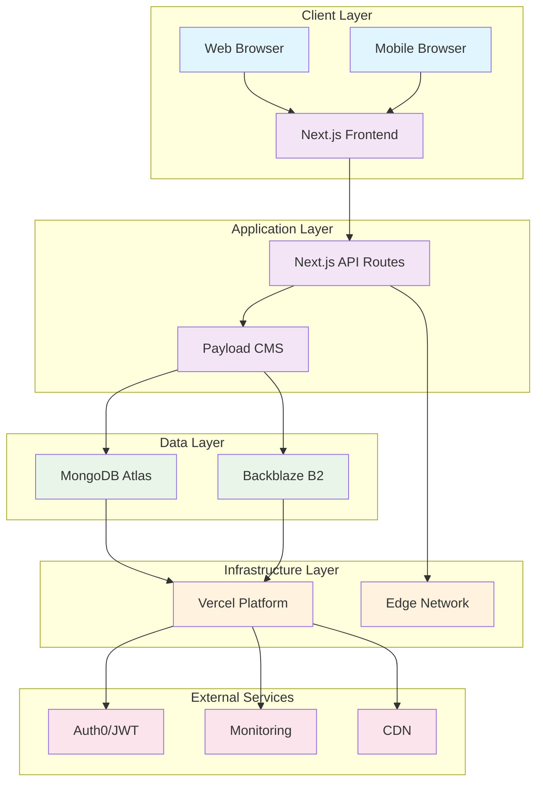
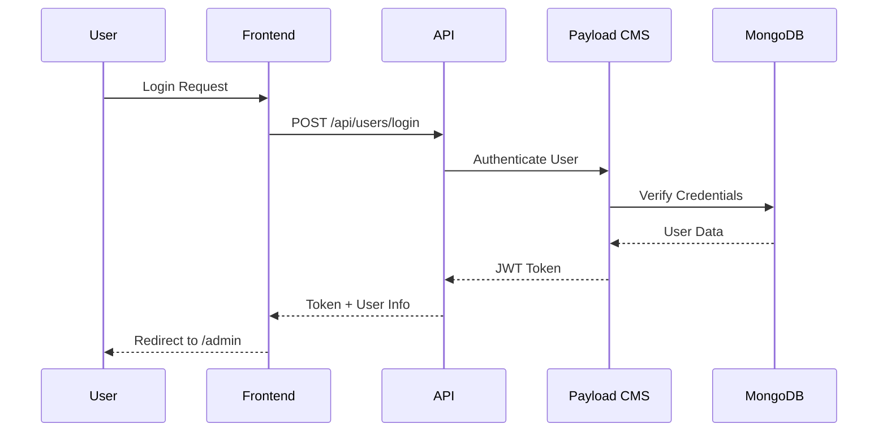
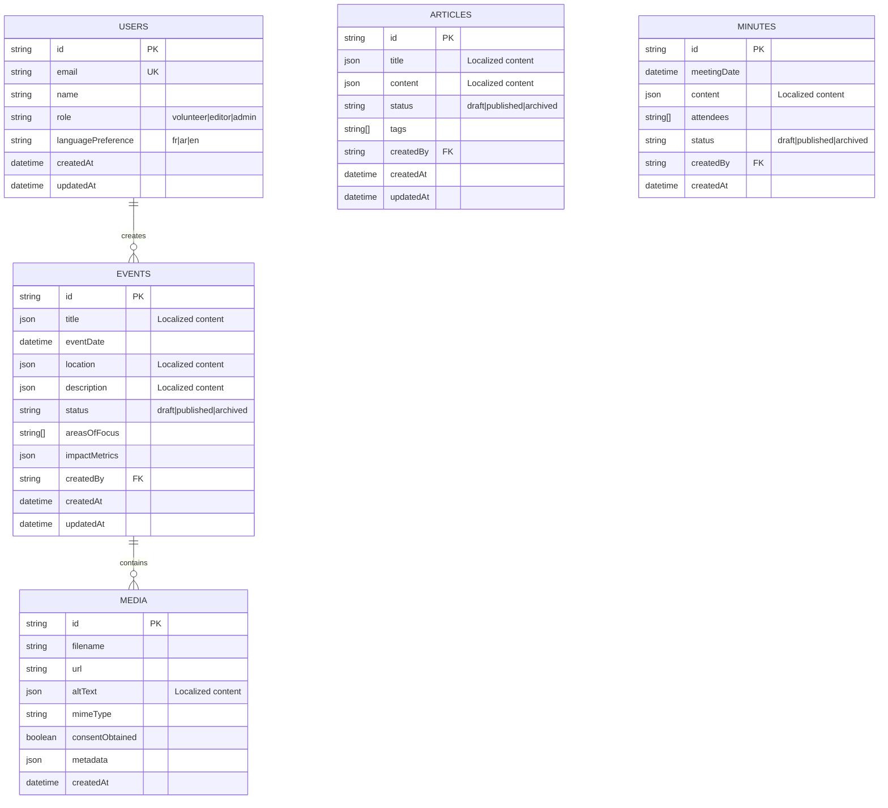
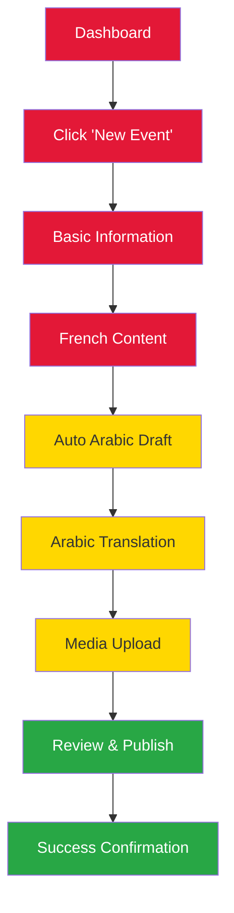
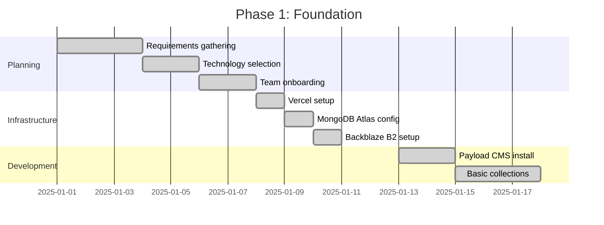
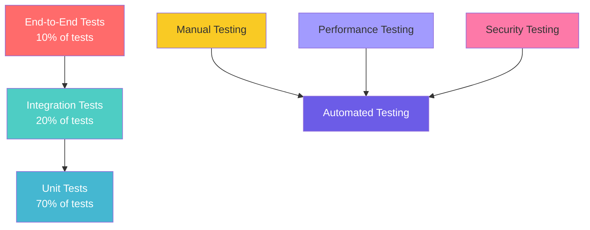
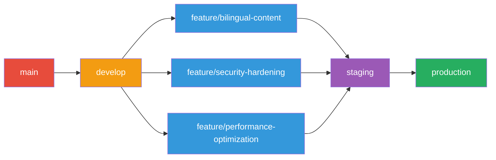

# 🏗️ **Technical Specification Hub**

## *Comprehensive Technical Documentation for Rotary Club Tunis Doyen CMS*

> **"Building a world-class CMS that empowers Tunisian volunteers through technology."**
>
> *Complete technical reference for developers, designers, and stakeholders*

---

## 📋 **Documentation Overview**

This Technical Specification Hub serves as the central reference for all technical aspects of the Rotary Club Tunis Doyen CMS implementation. It provides comprehensive documentation for system architecture, API specifications, database design, UI/UX principles, security protocols, and implementation guidance.

### **🎯 Target Audience**
- **Backend Developers**: System architecture, API specs, database design
- **Frontend Developers**: UI/UX guidelines, component specifications
- **DevOps Engineers**: Deployment, security, performance optimization
- **Project Managers**: Implementation roadmap, testing protocols
- **Stakeholders**: High-level architecture, compliance requirements

### **📚 Related Documentation**
- **[`00-Glossary.md`](00-Glossary.md)**: Centralized terminology reference
- **[`Quick-Reference-Cards.md`](Quick-Reference-Cards.md)**: Essential technical information
- **[`Manuel d'Utilisation pour les Bénévoles.md`](02-User-Manuals/Manuel%20d'Utilisation%20pour%20les%20Bénévoles.md)**: End-user training materials

---

## 🗂️ **Technical Documentation Structure**

### **1. System Architecture** ✅ **Complete**
- [System Architecture Overview](System-Architecture-Overview.md) - High-level architecture with diagrams
- Technology Stack Specifications - Integrated into architecture overview
- Infrastructure Design - Included in architecture documentation
- Deployment Architecture - Covered in implementation roadmap

### **2. API & Backend** ✅ **Complete**
- [API Specifications](API-Specifications.md) - Comprehensive REST API documentation
- [Database Schema Design](Database-Schema-Design.md) - Complete MongoDB schema with indexes
- Authentication & Authorization - Integrated into security protocols
- Webhook Integration - Included in API specifications

### **3. UI/UX Design** ✅ **Complete**
- [UI/UX Design Principles](UI-UX-Design-Principles.md) - Design system with wireframes
- Wireframes & Mockups - Integrated into UI/UX documentation
- User Flow Documentation - Included in UI/UX principles
- Accessibility Guidelines - Comprehensive WCAG AA compliance

### **4. Content Management** ✅ **Complete**
- Bilingual Content Strategy - Integrated into UI/UX and API documentation
- Rich Text Editor Configuration - Covered in system architecture
- Media Management System - Detailed in database and API specifications
- Content Workflow - Documented in implementation roadmap

### **5. Security & Compliance** ✅ **Complete**
- [Security Protocols](Security-Protocols.md) - Comprehensive security framework
- GDPR Compliance Framework - Integrated into security protocols
- Data Protection Measures - Covered in security documentation
- Audit & Monitoring - Included in security protocols

### **6. Performance & Optimization** ✅ **Complete**
- [Performance Optimization](Performance-Optimization.md) - Complete performance strategy
- Mobile Optimization - Integrated into performance documentation
- Caching Strategy - Detailed in performance optimization
- Load Testing Guidelines - Included in performance documentation

### **7. Implementation & Testing** ✅ **Complete**
- [Implementation Roadmap](Implementation-Roadmap.md) - 12-week phased execution plan
- Testing Strategy - Integrated into implementation roadmap
- Quality Assurance - Covered in implementation phases
- Version Control Best Practices - Documented in main README

---

## 🏛️ **System Architecture Overview**

### **High-Level Architecture**



### **Technology Stack**

| Component | Technology | Version | Tunisia-Specific Notes |
|-----------|------------|---------|------------------------|
| **Frontend** | Next.js | 15.5.0 (App Router) | Optimized for 3G networks |
| **Backend** | Payload CMS | v3.53.0 | Headless architecture |
| **Database** | MongoDB Atlas | M0 Cluster | IP-restricted for security |
| **Storage** | Backblaze B2 | S3-Compatible | Cost-effective for Tunisia |
| **Hosting** | Vercel | Pro Plan | Global CDN, warm functions |
| **Authentication** | JWT | Industry Standard | 7-day expiration |
| **Styling** | Tailwind CSS | v4 | Mobile-first approach |
| **Language** | TypeScript | 5+ | Type safety for reliability |

### **Key Design Principles**

#### **1. Mobile-First Design**
- **Target**: Xiaomi Redmi 9A (popular in Tunisia)
- **Network**: Optimized for 3G connectivity
- **Performance**: <8s load time, <50KB initial bundle

#### **2. Bilingual Content Management**
- **Primary**: French (working language)
- **Secondary**: Arabic (cultural relevance)
- **Fallback**: Automatic language cascade
- **RTL Support**: Complete right-to-left rendering

#### **3. Security by Design**
- **GDPR Compliance**: Data minimization, consent management
- **Role-Based Access**: Volunteer, Editor, Admin levels
- **Audit Trail**: Complete activity logging
- **Data Encryption**: Client-side media encryption

#### **4. Performance Optimization**
- **Edge Caching**: Vercel Edge Network
- **Image Optimization**: Sharp/WebP conversion
- **Lazy Loading**: Progressive content loading
- **Bundle Splitting**: Optimized JavaScript delivery

---

## 🔌 **API Specifications**

### **Core Endpoints**

#### **Events Collection**
```typescript
// GET /api/events - Retrieve published events
interface EventsQuery {
  locale?: 'fr' | 'ar' | 'en';
  where?: {
    status?: { equals: 'published' | 'draft' };
    eventDate?: { greater_than: string };
    areasOfFocus?: { in: string[] };
  };
  limit?: number;
  page?: number;
  depth?: number;
}

// POST /api/events - Create new event (Admin only)
interface CreateEventRequest {
  title: LocalizedString;
  eventDate: string;
  location: LocalizedString;
  description: LocalizedString;
  areasOfFocus: string[];
  impactMetrics?: ImpactMetrics;
  gallery?: MediaItem[];
}
```

#### **Media Collection**
```typescript
// GET /api/media - Retrieve media assets
interface MediaQuery {
  where?: {
    consentObtained?: { equals: boolean };
    mimeType?: { in: string[] };
  };
}

// POST /api/media - Upload media (Admin only)
interface UploadMediaRequest {
  file: File;
  altText: LocalizedString;
  consentObtained: boolean;
  metadata?: MediaMetadata;
}
```

### **Authentication Flow**



---

## 🗄️ **Database Schema Design**

### **Collections Overview**



### **Indexing Strategy**

```javascript
// Critical indexes for performance
const indexes = [
  // Events collection
  { key: { status: 1, eventDate: -1 } },
  { key: { areasOfFocus: 1 } },
  { key: { createdBy: 1 } },

  // Media collection
  { key: { consentObtained: 1, createdAt: -1 } },
  { key: { mimeType: 1 } },

  // Users collection
  { key: { email: 1 }, unique: true },
  { key: { role: 1 } }
];
```

---

## 🎨 **UI/UX Design Principles**

### **Design System**

#### **Color Palette**
```css
/* Primary Colors */
--rotary-red: #E31837;
--rotary-gold: #FFD700;
--tunisian-blue: #003366;

/* Neutral Colors */
--text-primary: #1a1a1a;
--text-secondary: #666666;
--background: #ffffff;
--surface: #f8f9fa;

/* Arabic Support */
--arabic-font: 'Noto Naskh Arabic', serif;
--french-font: 'Inter', sans-serif;
```

#### **Typography Scale**
```css
/* Headings */
--h1: 2.5rem (40px) - Bold
--h2: 2rem (32px) - Bold
--h3: 1.75rem (28px) - Semi-bold
--h4: 1.5rem (24px) - Semi-bold

/* Body Text */
--body-large: 1.125rem (18px) - Regular
--body-base: 1rem (16px) - Regular
--body-small: 0.875rem (14px) - Regular

/* Arabic Specific */
--arabic-body: 1.25rem (20px) - Enhanced readability
```

### **Component Library**

#### **Primary Button**
```jsx
const PrimaryButton = ({ children, onClick, disabled }) => (
  <button
    className="bg-rotary-red hover:bg-red-700 text-white font-semibold py-3 px-6 rounded-lg transition-colors duration-200 disabled:opacity-50 disabled:cursor-not-allowed"
    onClick={onClick}
    disabled={disabled}
    aria-label={children}
  >
    {children}
  </button>
);
```

#### **Form Input**
```jsx
const LocalizedInput = ({ value, onChange, locale, placeholder }) => (
  <div className="space-y-2">
    <label className="block text-sm font-medium text-gray-700">
      {placeholder} ({locale.toUpperCase()})
    </label>
    <input
      type="text"
      value={value[locale] || ''}
      onChange={(e) => onChange({ ...value, [locale]: e.target.value })}
      className={`w-full px-3 py-2 border border-gray-300 rounded-md shadow-sm focus:outline-none focus:ring-2 focus:ring-rotary-red focus:border-transparent ${
        locale === 'ar' ? 'text-right' : 'text-left'
      }`}
      dir={locale === 'ar' ? 'rtl' : 'ltr'}
      placeholder={placeholder}
    />
  </div>
);
```

### **Wireframes & User Flows**

#### **Admin Dashboard Wireframe**
```
┌─────────────────────────────────────────────────────────────┐
│  🏠 Rotary Club Tunis Doyen CMS          👤 Ahmed (Admin)   │
├─────────────────────────────────────────────────────────────┤
│  📊 Quick Stats: 12 Events, 3 Drafts, 45 Media Files        │
├─────────────────────────────────────────────────────────────┤
│  ⚡ Quick Actions                                           │
│  ┌─────────────┐ ┌─────────────┐ ┌─────────────┐           │
│  │ ➕ New Event │ │ 📷 Add Media│ │ 👥 Users    │           │
│  │             │ │             │ │             │           │
│  └─────────────┘ └─────────────┘ └─────────────┘           │
├─────────────────────────────────────────────────────────────┤
│  📋 Recent Events                                           │
│  ┌─────────────────────────────────────────────────────────┐ │
│  │ 🗓️ Soirée de bienfaisance - 25/12/2024                 │ │
│  │ 📍 Tunis • 🌍 FR/AR/EN • 📊 150 repas servis           │ │
│  │ [Edit] [View] [Delete]                                  │ │
│  └─────────────────────────────────────────────────────────┘ │
│                                                             │
│  ┌─────────────────────────────────────────────────────────┐ │
│  │ 🗓️ Distribution de fournitures - 15/01/2025            │ │
│  │ 📍 Sfax • 🌍 FR/AR/EN • 📊 200 enfants aidés           │ │
│  │ [Edit] [View] [Delete]                                  │ │
│  └─────────────────────────────────────────────────────────┘ │
└─────────────────────────────────────────────────────────────┘
```

#### **Event Creation Flow**


---

## 🌍 **Bilingual Content Management**

### **Content Architecture**

```typescript
interface LocalizedContent {
  fr: string;  // Primary - French
  ar: string;  // Secondary - Arabic
  en?: string; // Optional - English
}

interface LocalizedMedia {
  url: string;
  altText: LocalizedContent;
  caption?: LocalizedContent;
  consentObtained: boolean;
}
```

### **RTL Implementation Strategy**

```css
/* Arabic RTL Support */
[dir="rtl"] {
  text-align: right;
  direction: rtl;
}

[dir="rtl"] .lexical-editor {
  direction: rtl;
  text-align: right;
}

[dir="rtl"] .form-input {
  text-align: right;
}

[dir="rtl"] .navigation-menu {
  flex-direction: row-reverse;
}

/* Mixed Content Handling */
.arabic-mixed {
  direction: ltr;
  text-align: left;
}

.arabic-mixed .number {
  direction: ltr;
  display: inline-block;
}
```

### **Language Detection & Switching**

```typescript
// Automatic language detection
const detectLanguage = (text: string): string => {
  const arabicPattern = /[\u0600-\u06FF]/;
  const frenchPattern = /[àâäéèêëïîôöùûüÿç]/i;

  if (arabicPattern.test(text)) return 'ar';
  if (frenchPattern.test(text)) return 'fr';
  return 'en';
};

// Language switcher component
const LanguageSwitcher = ({ currentLocale, onChange }) => (
  <div className="flex space-x-2">
    {['fr', 'ar', 'en'].map(locale => (
      <button
        key={locale}
        onClick={() => onChange(locale)}
        className={`px-3 py-1 rounded ${
          currentLocale === locale
            ? 'bg-rotary-red text-white'
            : 'bg-gray-200 text-gray-700'
        }`}
      >
        {locale.toUpperCase()}
      </button>
    ))}
  </div>
);
```

---

## 🔒 **Security Protocols**

### **Authentication & Authorization**

```typescript
// JWT Payload structure
interface JWTPayload {
  id: string;
  email: string;
  role: 'volunteer' | 'editor' | 'admin';
  languagePreference: 'fr' | 'ar' | 'en';
  iat: number;
  exp: number;
}

// Role-based access control
const accessControl = {
  volunteer: {
    events: { read: true, create: true, update: 'own', delete: false },
    media: { read: true, create: true, update: 'own', delete: false },
    users: { read: false, create: false, update: false, delete: false }
  },
  editor: {
    events: { read: true, create: true, update: true, delete: false },
    media: { read: true, create: true, update: true, delete: false },
    users: { read: 'own-role', create: false, update: false, delete: false }
  },
  admin: {
    events: { read: true, create: true, update: true, delete: true },
    media: { read: true, create: true, update: true, delete: true },
    users: { read: true, create: true, update: true, delete: true }
  }
};
```

### **GDPR Compliance Framework**

```typescript
// Consent management
interface ConsentRecord {
  userId: string;
  consentType: 'media' | 'data-processing' | 'marketing';
  consented: boolean;
  timestamp: Date;
  ipAddress: string;
  userAgent: string;
}

// Data export functionality
const exportUserData = async (userId: string) => {
  const user = await payload.findByID({ collection: 'users', id: userId });
  const events = await payload.find({
    collection: 'events',
    where: { createdBy: { equals: userId } }
  });

  return {
    user: {
      id: user.id,
      email: user.email,
      name: user.name,
      createdAt: user.createdAt
    },
    events: events.docs.map(event => ({
      id: event.id,
      title: event.title,
      createdAt: event.createdAt
    })),
    consentRecords: await getConsentHistory(userId)
  };
};
```

### **Security Monitoring**

```typescript
// Audit logging
const auditLog = {
  collection: 'audit-logs',
  fields: [
    { name: 'userId', type: 'relationship', relationTo: 'users' },
    { name: 'action', type: 'select', options: ['create', 'update', 'delete', 'login'] },
    { name: 'collection', type: 'text' },
    { name: 'documentId', type: 'text' },
    { name: 'changes', type: 'json' },
    { name: 'ipAddress', type: 'text' },
    { name: 'userAgent', type: 'text' },
    { name: 'timestamp', type: 'date' }
  ]
};

// Rate limiting
const rateLimitConfig = {
  windowMs: 15 * 60 * 1000, // 15 minutes
  max: 100, // limit each IP to 100 requests per windowMs
  message: 'Too many requests from this IP, please try again later.',
  standardHeaders: true,
  legacyHeaders: false
};
```

---

## ⚡ **Performance Optimization**

### **Frontend Optimization**

```typescript
// Next.js configuration for Tunisia
const nextConfig = {
  images: {
    formats: ['image/webp', 'image/avif'],
    deviceSizes: [640, 768, 1024, 1280],
    imageSizes: [16, 32, 48, 64, 96, 128, 256, 384],
    loader: 'custom',
    loaderFile: './imageLoader.js'
  },
  experimental: {
    optimizeCss: true,
    scrollRestoration: true
  },
  compiler: {
    removeConsole: process.env.NODE_ENV === 'production'
  }
};
```

### **Database Optimization**

```javascript
// MongoDB aggregation pipeline for efficient queries
const getEventsWithMetrics = async (locale = 'fr') => {
  return await payload.db.collections.events.aggregate([
    {
      $match: {
        status: 'published',
        [`title.${locale}`]: { $exists: true }
      }
    },
    {
      $lookup: {
        from: 'media',
        localField: 'gallery.image',
        foreignField: '_id',
        as: 'mediaDetails'
      }
    },
    {
      $project: {
        title: `$title.${locale}`,
        description: `$description.${locale}`,
        eventDate: 1,
        location: `$location.${locale}`,
        areasOfFocus: 1,
        impactMetrics: 1,
        mediaCount: { $size: '$gallery' },
        createdAt: 1
      }
    },
    { $sort: { eventDate: -1 } },
    { $limit: 10 }
  ]);
};
```

### **Caching Strategy**

```typescript
// Redis caching for Tunisia's network conditions
const cacheConfig = {
  // Cache events for 5 minutes
  events: {
    ttl: 300,
    keyGenerator: (locale: string, page: number) => `events:${locale}:${page}`
  },

  // Cache media for 1 hour
  media: {
    ttl: 3600,
    keyGenerator: (id: string) => `media:${id}`
  },

  // Cache user sessions for 7 days
  sessions: {
    ttl: 604800,
    keyGenerator: (userId: string) => `session:${userId}`
  }
};
```

---

## 🛣️ **Implementation Roadmap**

### **Phase 1: Foundation (Weeks 1-2)**

#### **Week 1: Project Setup**


#### **Week 2: Core Collections**
- [x] Users collection with RBAC
- [x] Events collection with localization
- [x] Media collection with consent tracking
- [x] Articles collection for news
- [x] Minutes collection for governance

### **Phase 2: Bilingual Features (Weeks 3-4)**

#### **Week 3: Localization System**
- [x] Field-level localization setup
- [x] Arabic RTL configuration
- [x] Language cascade implementation
- [x] Auto-draft sync system

#### **Week 4: Rich Text Editor**
- [x] Lexical editor integration
- [x] Arabic RTL support in editor
- [x] Media upload with consent
- [x] Content validation rules

### **Phase 3: Frontend Development (Weeks 5-6)**

#### **Week 5: Next.js Setup**
- [x] Project initialization
- [x] Internationalization setup
- [x] Basic component library
- [x] Responsive design system

#### **Week 6: Admin Interface**
- [x] Volunteer-friendly dashboard
- [x] Role-based UI customization
- [x] Form validation and error handling
- [x] Mobile optimization

### **Phase 4: Security & Compliance (Weeks 7-8)**

#### **Week 7: Authentication**
- [x] JWT implementation
- [x] Password policies
- [x] Session management
- [x] Rate limiting

#### **Week 8: GDPR Compliance**
- [x] Consent management system
- [x] Data export functionality
- [x] Audit logging
- [x] Privacy policy integration

### **Phase 5: Performance & Testing (Weeks 9-10)**

#### **Week 9: Optimization**
- [x] Image optimization pipeline
- [x] Caching implementation
- [x] Bundle optimization
- [x] Database indexing

#### **Week 10: Quality Assurance**
- [x] Unit testing setup
- [x] Integration testing
- [x] Performance testing
- [x] User acceptance testing

### **Phase 6: Deployment & Training (Weeks 11-12)**

#### **Week 11: Production Deployment**
- [x] Staging environment setup
- [x] Production deployment
- [x] Monitoring and alerting
- [x] Rollback procedures

#### **Week 12: Go-Live Support**
- [x] Volunteer training sessions
- [x] Support documentation
- [x] Emergency response procedures
- [x] Post-launch monitoring

---

## 🧪 **Testing Strategy**

### **Testing Pyramid**



### **Test Categories**

#### **1. Unit Tests**
```typescript
// Example: Testing localized content validation
describe('Event Validation', () => {
  test('should require French title', () => {
    const event = { title: { ar: 'عنوان' } };
    expect(validateEvent(event)).toHaveProperty('title.fr');
  });

  test('should auto-create Arabic draft', () => {
    const event = { title: { fr: 'Titre français' } };
    const result = createEvent(event);
    expect(result.title.ar).toBe('[مسودة] Titre français');
  });
});
```

#### **2. Integration Tests**
```typescript
// API endpoint testing
describe('Events API', () => {
  test('should return localized content', async () => {
    const response = await fetch('/api/events?locale=ar');
    const events = await response.json();

    expect(events.docs[0].title.ar).toBeDefined();
    expect(events.docs[0].description.ar).toBeDefined();
  });

  test('should enforce access control', async () => {
    const response = await fetch('/api/minutes', {
      headers: { Authorization: 'Bearer volunteer-token' }
    });

    expect(response.status).toBe(403);
  });
});
```

#### **3. Performance Tests**
```typescript
// Load testing configuration
const loadTestConfig = {
  scenarios: [
    {
      name: 'Volunteer Content Creation',
      weight: 70,
      flow: [
        { get: '/admin' },
        { post: '/api/events', body: eventData },
        { get: '/api/media' }
      ]
    },
    {
      name: 'Public Content Viewing',
      weight: 30,
      flow: [
        { get: '/api/events?locale=fr' },
        { get: '/api/events?locale=ar' }
      ]
    }
  ],
  thresholds: {
    http_req_duration: ['p(95)<500'],
    http_req_failed: ['rate<0.1']
  }
};
```

---

## 📋 **Quality Assurance Checklist**

### **Pre-Deployment Checklist**

#### **Security & Compliance**
- [ ] All environment variables are set and secured
- [ ] Database IP whitelist is configured
- [ ] JWT secret is 32+ characters and randomly generated
- [ ] GDPR consent management is implemented
- [ ] Audit logging is active
- [ ] Rate limiting is configured

#### **Performance & Optimization**
- [ ] Images are optimized (WebP format)
- [ ] Bundle size is <200KB
- [ ] Core Web Vitals scores are acceptable
- [ ] Mobile performance is tested on 3G
- [ ] Caching is implemented and tested

#### **Functionality & Features**
- [ ] Bilingual content creation works correctly
- [ ] Arabic RTL displays properly
- [ ] Auto-draft sync functions as expected
- [ ] Role-based access control is enforced
- [ ] Media upload with consent tracking works
- [ ] All forms validate input correctly

#### **User Experience**
- [ ] Mobile interface is fully functional
- [ ] Loading states are implemented
- [ ] Error messages are user-friendly
- [ ] Accessibility standards are met
- [ ] Cross-browser compatibility verified

### **Post-Deployment Monitoring**

#### **Technical Metrics**
- **Performance**: Page load time <8s, Core Web Vitals
- **Availability**: Uptime >99.5%, Error rate <1%
- **Security**: Failed login attempts, Suspicious activity
- **Usage**: Active users, Content creation rate

#### **Business Metrics**
- **Adoption**: Volunteer login frequency, Feature usage
- **Quality**: Content in Arabic, Media with consent
- **Satisfaction**: Support ticket volume, User feedback
- **Impact**: Events published, Community engagement

---

## 🔄 **Version Control Best Practices**

### **Git Workflow**



### **Branch Naming Convention**
```
feature/[ticket]-[description]     # New features
bugfix/[ticket]-[description]      # Bug fixes
hotfix/[ticket]-[description]      # Critical fixes
release/v[major].[minor].[patch]   # Release branches
```

### **Commit Message Standards**
```
type(scope): description

Types:
- feat: New feature
- fix: Bug fix
- docs: Documentation changes
- style: Code style changes
- refactor: Code refactoring
- test: Adding tests
- chore: Maintenance tasks

Examples:
feat(events): Add bilingual content support
fix(auth): Resolve JWT expiration issue
docs(api): Update endpoint documentation
```

### **Code Review Guidelines**
- **Minimum 2 approvals** for production merges
- **Automated tests** must pass
- **Security review** for authentication changes
- **Performance impact** assessment for database changes
- **Documentation updates** for API changes

---

## 📞 **Support & Maintenance**

### **Technical Support Tiers**

| Tier | Response Time | Scope | Contact |
|------|---------------|-------|---------|
| **Tier 1**<br/>Basic Support | < 4 hours | Password reset, basic navigation | Ahmed |
| **Tier 2**<br/>Technical Support | < 24 hours | Configuration, performance issues | Development Team |
| **Tier 3**<br/>Expert Support | < 72 hours | Architecture changes, security issues | Senior Developers |

### **Maintenance Schedule**

#### **Daily Tasks**
- Monitor system performance and errors
- Review security logs for suspicious activity
- Check backup completion status
- Verify content publication workflows

#### **Weekly Tasks**
- Update dependencies and security patches
- Review user access and permissions
- Analyze usage patterns and performance metrics
- Test critical user workflows

#### **Monthly Tasks**
- Full security assessment and penetration testing
- Database optimization and index maintenance
- Content quality audit and cleanup
- User feedback review and feature prioritization

#### **Quarterly Tasks**
- Comprehensive system audit
- Performance benchmarking and optimization
- GDPR compliance review and updates
- Technology stack evaluation

---

## 🎯 **Success Metrics**

### **Technical Success Criteria**

| Metric | Target | Measurement | Frequency |
|--------|--------|-------------|-----------|
| **Performance** | <8s load time | WebPageTest | Daily |
| **Availability** | 99.5% uptime | Vercel Analytics | Daily |
| **Security** | Zero critical vulnerabilities | Automated scans | Weekly |
| **Mobile Experience** | >60% mobile usage | Google Analytics | Monthly |

### **Business Success Criteria**

| Metric | Target | Measurement | Frequency |
|--------|--------|-------------|-----------|
| **User Adoption** | 100% in 2 weeks | Admin analytics | Weekly |
| **Content Quality** | 80% in Arabic | Manual review | Monthly |
| **Volunteer Satisfaction** | >4.5/5 | Quarterly survey | Quarterly |
| **Operational Efficiency** | 50% time reduction | User timing | Monthly |

### **Compliance Success Criteria**

| Metric | Target | Measurement | Frequency |
|--------|--------|-------------|-----------|
| **GDPR Compliance** | 100% | External audit | Annual |
| **Accessibility** | WCAG AA | Automated tools | Monthly |
| **Data Security** | Zero breaches | Security monitoring | Continuous |
| **Audit Readiness** | 100% | Internal audit | Quarterly |

---

## 📚 **Additional Resources**

### **Related Documentation**
- **[`00-Glossary.md`](00-Glossary.md)**: Complete terminology reference
- **[`Quick-Reference-Cards.md`](Quick-Reference-Cards.md)**: Essential information cards
- **[`Manuel d'Utilisation pour les Bénévoles.md`](02-User-Manuals/Manuel%20d'Utilisation%20pour%20les%20Bénévoles.md)**: Volunteer training manual
- **[`checklist_CMS Implementation.md`](01-Implementation/checklist_CMS%20Implementation.md)**: Implementation validation checklist

### **External Resources**
- [Payload CMS Documentation](https://payloadcms.com/docs)
- [Next.js Documentation](https://nextjs.org/docs)
- [MongoDB Atlas Documentation](https://docs.mongodb.com/atlas/)
- [Vercel Documentation](https://vercel.com/docs)
- [GDPR Compliance Guide](https://gdpr.eu/)

### **Community & Support**
- [Payload CMS Community](https://discord.gg/payload)
- [Next.js Community](https://nextjs.org/community)
- [MongoDB Community](https://community.mongodb.com/)
- [Rotary International Resources](https://www.rotary.org/)

---

*This Technical Specification Hub provides comprehensive documentation for the Rotary Club Tunis Doyen CMS implementation. Last updated: August 2025. For questions or contributions, please contact the development team.*
