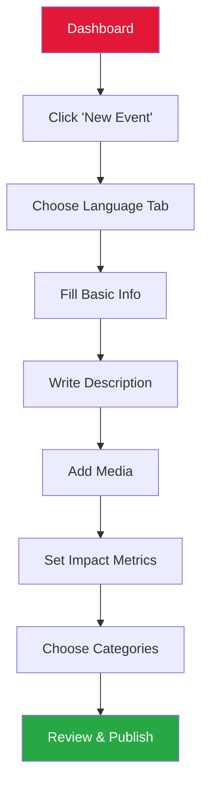
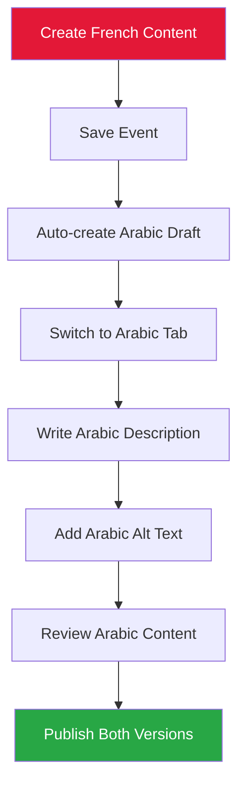
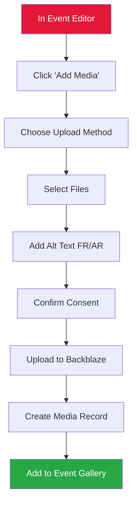
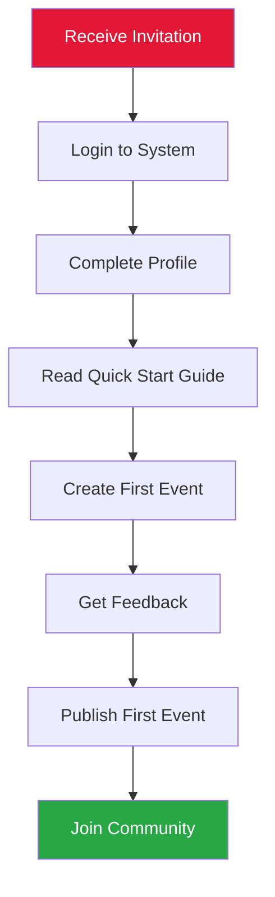

# 🎨 **UI/UX Design Principles**

## *Complete Design System for Rotary Club Tunis Doyen CMS*

---

## 📋 **Design Overview**

The Rotary Club Tunis Doyen CMS design system is built on principles of accessibility, cultural sensitivity, and mobile-first design. The interface must accommodate French and Arabic content, work seamlessly on mobile devices, and provide an intuitive experience for volunteers with varying technical skills.

### **Core Design Principles**

#### **1. Cultural Sensitivity**
- **Arabic RTL Support**: Complete right-to-left layout for Arabic content
- **Cultural Colors**: Use of Rotary's red and gold with Tunisian cultural elements
- **Language Switching**: Seamless transition between French and Arabic interfaces
- **Cultural Icons**: Appropriate symbols that work across both cultures

#### **2. Mobile-First Approach**
- **Touch-Friendly**: 48px minimum touch targets
- **Progressive Enhancement**: Core functionality works on basic mobile browsers
- **Offline Capability**: Critical features work without internet
- **Performance**: Optimized for 3G networks common in Tunisia

#### **3. Accessibility First**
- **WCAG 2.1 AA Compliance**: Full accessibility for users with disabilities
- **Screen Reader Support**: Arabic screen reader compatibility
- **Keyboard Navigation**: Full keyboard accessibility
- **High Contrast**: Sufficient color contrast for readability

#### **4. Volunteer-Centric Design**
- **Progressive Disclosure**: Show only necessary information initially
- **Clear Visual Hierarchy**: Important actions are prominent
- **Error Prevention**: Guide users to prevent mistakes
- **Feedback Systems**: Clear success and error messages

---

## 🎨 **Design System**

### **Color Palette**

```css
/* Primary Brand Colors */
:root {
  /* Rotary International Colors */
  --rotary-red: #E31837;
  --rotary-gold: #FFD700;
  --rotary-blue: #003366;

  /* Semantic Colors */
  --success: #28a745;
  --warning: #ffc107;
  --error: #dc3545;
  --info: #17a2b8;

  /* Neutral Colors */
  --white: #ffffff;
  --gray-50: #f8f9fa;
  --gray-100: #e9ecef;
  --gray-200: #dee2e6;
  --gray-300: #ced4da;
  --gray-400: #adb5bd;
  --gray-500: #6c757d;
  --gray-600: #495057;
  --gray-700: #343a40;
  --gray-800: #212529;
  --gray-900: #000000;

  /* Arabic-Specific Colors */
  --arabic-text: #1a1a1a;
  --arabic-background: #ffffff;
  --arabic-accent: #2c3e50;
}
```

### **Typography System**

```css
/* Font Families */
:root {
  --font-primary: 'Inter', -apple-system, BlinkMacSystemFont, 'Segoe UI', sans-serif;
  --font-arabic: 'Noto Naskh Arabic', 'Tajawal', 'Cairo', serif;
  --font-mono: 'JetBrains Mono', 'Fira Code', monospace;
}

/* Font Sizes */
:root {
  --text-xs: 0.75rem;    /* 12px */
  --text-sm: 0.875rem;   /* 14px */
  --text-base: 1rem;     /* 16px */
  --text-lg: 1.125rem;   /* 18px */
  --text-xl: 1.25rem;    /* 20px */
  --text-2xl: 1.5rem;    /* 24px */
  --text-3xl: 1.875rem;  /* 30px */
  --text-4xl: 2.25rem;   /* 36px */
  --text-5xl: 3rem;      /* 48px */
}

/* Arabic Typography */
:root {
  --arabic-text-base: 1.25rem;  /* 20px - Enhanced readability */
  --arabic-text-lg: 1.5rem;     /* 24px */
  --arabic-line-height: 1.8;    /* Better for Arabic script */
}
```

### **Spacing Scale**

```css
/* Spacing Scale */
:root {
  --space-1: 0.25rem;   /* 4px */
  --space-2: 0.5rem;    /* 8px */
  --space-3: 0.75rem;   /* 12px */
  --space-4: 1rem;      /* 16px */
  --space-5: 1.25rem;   /* 20px */
  --space-6: 1.5rem;    /* 24px */
  --space-8: 2rem;      /* 32px */
  --space-10: 2.5rem;   /* 40px */
  --space-12: 3rem;     /* 48px */
  --space-16: 4rem;     /* 64px */
  --space-20: 5rem;     /* 80px */
  --space-24: 6rem;     /* 96px */
}
```

### **Component Tokens**

```css
/* Button Variants */
:root {
  --button-primary: {
    background: var(--rotary-red);
    color: white;
    border: none;
    border-radius: 0.5rem;
    padding: 0.75rem 1.5rem;
    font-weight: 600;
    transition: all 0.2s ease;
  };

  --button-secondary: {
    background: white;
    color: var(--rotary-red);
    border: 2px solid var(--rotary-red);
    border-radius: 0.5rem;
    padding: 0.75rem 1.5rem;
    font-weight: 600;
  };

  --button-ghost: {
    background: transparent;
    color: var(--gray-600);
    border: none;
    padding: 0.75rem 1.5rem;
  };
}

/* Form Elements */
:root {
  --input-default: {
    border: 2px solid var(--gray-300);
    border-radius: 0.5rem;
    padding: 0.75rem;
    font-size: var(--text-base);
    transition: border-color 0.2s ease;
  };

  --input-focus: {
    border-color: var(--rotary-red);
    box-shadow: 0 0 0 3px rgba(227, 24, 55, 0.1);
  };

  --input-error: {
    border-color: var(--error);
    box-shadow: 0 0 0 3px rgba(220, 53, 69, 0.1);
  };
}
```

---

## 🖼️ **Wireframes & Mockups**

### **Admin Dashboard Wireframe**

```
┌─────────────────────────────────────────────────────────────┐
│  🏠 Rotary Club Tunis Doyen CMS          👤 Ahmed (Admin)   │
├─────────────────────────────────────────────────────────────┤
│  📊 Quick Stats                                             │
│  ┌─────────────┬─────────────┬─────────────┬─────────────┐   │
│  │ 📝 12 Events│ 🖼️ 45 Media │ 👥 8 Users  │ 🌍 80% Arabic│   │
│  │ 3 Draft     │ 100% Consent│ 2 New      │ Coverage     │   │
│  └─────────────┴─────────────┴─────────────┴─────────────┘   │
├─────────────────────────────────────────────────────────────┤
│  ⚡ Quick Actions                                           │
│  ┌─────────────┐ ┌─────────────┐ ┌─────────────┐           │
│  │ ➕ New Event │ │ 🖼️ Add Media│ │ 👥 Users    │           │
│  │             │ │             │ │             │           │
│  └─────────────┘ └─────────────┘ └─────────────┘           │
├─────────────────────────────────────────────────────────────┤
│  📋 Recent Events                                           │
│  ┌─────────────────────────────────────────────────────────┐ │
│  │ 🗓️ Soirée de bienfaisance - 25/12/2024                 │ │
│  │ 📍 Tunis • 🌍 FR/AR/EN • 📊 150 repas servis           │ │
│  │ [Edit] [View] [Delete]                                  │ │
│  └─────────────────────────────────────────────────────────┘ │
│                                                             │
│  ┌─────────────────────────────────────────────────────────┐ │
│  │ 🗓️ Distribution de fournitures - 15/01/2025            │ │
│  │ 📍 Sfax • 🌍 FR/AR/EN • 📊 200 enfants aidés           │ │
│  │ [Edit] [View] [Delete]                                  │ │
│  └─────────────────────────────────────────────────────────┘ │
└─────────────────────────────────────────────────────────────┘
```

### **Event Creation Form**

```
┌─────────────────────────────────────────────────────────────┐
│  ← Back to Events                    ➕ Create New Event     │
├─────────────────────────────────────────────────────────────┤
│  🌍 Language Tabs: [FR] [AR] [EN]                          │
├─────────────────────────────────────────────────────────────┤
│  📝 Basic Information                                       │
│  ┌─────────────────────────────────────────────────────────┐ │
│  │ Title (FR): [Soirée de bienfaisance_________________]   │ │
│  │ Title (AR): [المساء الخيري____________________________]   │ │
│  │ Date: [📅 25/12/2024]  Time: [🕐 18:00]                 │ │
│  │ Location (FR): [Salle des fêtes, Tunis_______________]  │ │
│  └─────────────────────────────────────────────────────────┘ │
├─────────────────────────────────────────────────────────────┤
│  📝 Description                                             │
│  ┌─────────────────────────────────────────────────────────┐ │
│  │ ┌─────────────────────────────────────────────────────┐ │ │
│  │ │ [Rich text editor with Arabic RTL support]         │ │ │
│  │ │ [B] [I] [U] [Link] [Image] [List] [RTL] [LTR]      │ │ │
│  │ │ ┌─────────────────────────────────────────────────┐ │ │ │
│  │ │ │ Description en français...                      │ │ │ │
│  │ │ └─────────────────────────────────────────────────┘ │ │ │
│  │ └─────────────────────────────────────────────────────┘ │ │
│  └─────────────────────────────────────────────────────────┘ │
├─────────────────────────────────────────────────────────────┤
│  🖼️ Media Gallery                                          │
│  ┌─────────────────────────────────────────────────────────┐ │
│  │ 📷 [Add Images] [Upload from Device]                   │ │
│  │                                                         │ │
│  │ ☑ Consent obtained for all images                      │ │
│  │                                                         │ │
│  │ [Image thumbnail] [Image thumbnail] [Image thumbnail]   │ │
│  └─────────────────────────────────────────────────────────┘ │
├─────────────────────────────────────────────────────────────┤
│  📊 Impact Metrics                                         │
│  ┌─────────────────────────────────────────────────────────┐ │
│  │ Meals Served: [150]  Trees Planted: [0]               │ │
│  │ Volunteer Hours: [25] People Reached: [200]           │ │
│  └─────────────────────────────────────────────────────────┘ │
├─────────────────────────────────────────────────────────────┤
│  🏷️ Categories                                             │
│  ┌─────────────────────────────────────────────────────────┐ │
│  │ ☑ Health ☐ Education ☐ Environment ☐ Peace           │ │
│  │ ☐ Economic Development ☐ Water ☐ Maternal/Child       │ │
│  └─────────────────────────────────────────────────────────┘ │
├─────────────────────────────────────────────────────────────┤
│  💾 Actions                                                │
│  [Save Draft] [Preview] [Publish]                          │
└─────────────────────────────────────────────────────────────┘
```

### **Volunteer-Friendly Dashboard**

```
┌─────────────────────────────────────────────────────────────┐
│  مرحباً Ahmed!                           👤 Ahmed (Volunteer) │
├─────────────────────────────────────────────────────────────┤
│  📝 Mes Actions Rapides                                     │
│  ┌─────────────┐ ┌─────────────┐ ┌─────────────┐           │
│  │ ➕ Créer     │ │ 📝 Mes      │ │ 🖼️ Ajouter  │           │
│  │ un Événement│ │ Événements  │ │ une Photo   │           │
│  │             │ │             │ │             │           │
│  │ [FR] [AR]   │ │ 3 Brouillons│ │ avec Consent│           │
│  └─────────────┘ └─────────────┘ └─────────────┘           │
├─────────────────────────────────────────────────────────────┤
│  📋 Mes Événements Récents                                  │
│  ┌─────────────────────────────────────────────────────────┐ │
│  │ 🗓️ Soirée de bienfaisance                              │ │
│  │ 📝 Brouillon • 🌍 FR ✓ AR ✓ • 📊 150 repas servis      │ │
│  │ [Modifier] [Prévisualiser] [Publier]                    │ │
│  └─────────────────────────────────────────────────────────┘ │
│                                                             │
│  ┌─────────────────────────────────────────────────────────┐ │
│  │ 🗓️ Distribution de fournitures                          │ │
│  │ 📝 Brouillon • 🌍 FR ✓ AR en cours • 📊 200 enfants    │ │
│  │ [Modifier] [Prévisualiser] [Publier]                    │ │
│  └─────────────────────────────────────────────────────────┘ │
├─────────────────────────────────────────────────────────────┤
│  💡 Conseils pour Aujourd'hui                               │
│  ┌─────────────────────────────────────────────────────────┐ │
│  │ 📸 N'oubliez pas d'obtenir le consentement            │ │
│  │  Vérifiez l'orthographe arabe avec un ami            │ │
│  │ 📊 Ajoutez des métriques d'impact pour plus d'impact   │ │
│  └─────────────────────────────────────────────────────────┘ │
└─────────────────────────────────────────────────────────────┘
```

### **Mobile Event Creation**

```
┌─────────────────┐
│ ← Create Event  │
├─────────────────┤
│ 🌍 [FR] [AR] [EN]│
├─────────────────┤
│ Title (FR)      │
│ [Soirée...]     │
├─────────────────┤
│ Date            │
│ [📅 25/12/2024] │
├─────────────────┤
│ Location        │
│ [Salle des...]  │
├─────────────────┤
│ Description     │
│ ┌─────────────┐ │
│ │ [Rich text │ │
│ │  editor]   │ │
│ └─────────────┘ │
├─────────────────┤
│ 📷 Add Photos   │
│ [📱 Camera]     │
├─────────────────┤
│ Impact Metrics  │
│ Meals: [150]    │
├─────────────────┤
│ Categories      │
│ ☑ Health       │
├─────────────────┤
│ [Save Draft]    │
│ [Publish]       │
└─────────────────┘
```

---

## 🔄 **User Flows**

### **Event Creation Flow**



### **Arabic Content Creation Flow**



### **Media Upload Flow**



### **Volunteer Onboarding Flow**



---

## ♿ **Accessibility Guidelines**

### **WCAG 2.1 AA Compliance**

#### **1. Perceivable**
- **Text Alternatives**: All images have descriptive alt text in French and Arabic
- **Time-based Media**: No time-based media requiring accessibility
- **Adaptable**: Content works with different screen sizes and orientations
- **Distinguishable**: Sufficient color contrast (4.5:1 ratio minimum)

#### **2. Operable**
- **Keyboard Accessible**: All functions available via keyboard navigation
- **Enough Time**: No time limits for content creation
- **Seizures**: No flashing content that could trigger seizures
- **Navigable**: Clear navigation structure and focus indicators

#### **3. Understandable**
- **Readable**: Clear, simple language with progressive disclosure
- **Predictable**: Consistent navigation and behavior patterns
- **Input Assistance**: Clear error messages and input validation

#### **4. Robust**
- **Compatible**: Works with current and future assistive technologies
- **Standards**: Follows HTML5 and ARIA standards

### **Arabic Accessibility Features**

```html
<!-- Arabic Content with Proper Semantics -->
<article lang="ar" dir="rtl" class="event-card">
  <header>
    <h2 id="event-title">المساء الخيري</h2>
    <time datetime="2024-12-25" aria-label="تاريخ الفعالية">25 ديسمبر 2024</time>
  </header>

  <div class="content" role="main" aria-labelledby="event-title">
    <p>وصف الفعالية باللغة العربية...</p>
  </div>

  <footer>
    <button aria-describedby="publish-help">
      <span aria-hidden="true">📝</span>
      تعديل
    </button>
    <span id="publish-help" class="sr-only">
      يفتح نموذج تعديل الفعالية
    </span>
  </footer>
</article>
```

### **Screen Reader Support**

```javascript
// Arabic screen reader announcements
const announceToScreenReader = (message, priority = 'polite') => {
  const announcement = document.createElement('div');
  announcement.setAttribute('aria-live', priority);
  announcement.setAttribute('aria-atomic', 'true');
  announcement.className = 'sr-only';
  announcement.textContent = message;

  document.body.appendChild(announcement);

  setTimeout(() => {
    document.body.removeChild(announcement);
  }, 1000);
};

// Usage examples
announceToScreenReader('تم حفظ الفعالية بنجاح', 'assertive');
announceToScreenReader('يتم الآن تحميل الصور', 'polite');
```

### **Keyboard Navigation**

```css
/* Focus indicators for keyboard navigation */
*:focus {
  outline: 2px solid var(--rotary-red);
  outline-offset: 2px;
  border-radius: 4px;
}

/* Skip links for screen readers */
.skip-link {
  position: absolute;
  top: -40px;
  left: 6px;
  background: var(--rotary-red);
  color: white;
  padding: 8px;
  text-decoration: none;
  border-radius: 4px;
  z-index: 1000;
}

.skip-link:focus {
  top: 6px;
}
```

---

## 🌍 **Bilingual Interface Design**

### **Language Switching Mechanism**

```jsx
const LanguageSwitcher = ({ currentLocale, onChange }) => {
  const languages = [
    { code: 'fr', name: 'Français', flag: '🇫🇷' },
    { code: 'ar', name: 'العربية', flag: '🇹🇳' },
    { code: 'en', name: 'English', flag: '🇬🇧' }
  ];

  return (
    <div className="language-switcher" role="tablist">
      {languages.map(lang => (
        <button
          key={lang.code}
          role="tab"
          aria-selected={currentLocale === lang.code}
          onClick={() => onChange(lang.code)}
          className={`lang-tab ${currentLocale === lang.code ? 'active' : ''}`}
        >
          <span aria-hidden="true">{lang.flag}</span>
          <span className="sr-only">{lang.name}</span>
          <span className="lang-code">{lang.code.toUpperCase()}</span>
        </button>
      ))}
    </div>
  );
};
```

### **RTL Layout System**

```css
/* RTL Container */
.rtl-container {
  direction: rtl;
  text-align: right;
}

/* RTL Form Layout */
.rtl-form .form-group {
  display: flex;
  flex-direction: column;
}

.rtl-form .form-label {
  text-align: right;
  margin-bottom: var(--space-2);
}

.rtl-form .form-input {
  text-align: right;
  padding: var(--space-3);
}

/* RTL Navigation */
.rtl-nav {
  flex-direction: row-reverse;
}

.rtl-nav .nav-item {
  margin-left: 0;
  margin-right: var(--space-4);
}

/* RTL Button Groups */
.rtl-buttons .btn {
  margin-left: var(--space-2);
  margin-right: 0;
}

.rtl-buttons .btn:first-child {
  margin-right: 0;
}
```

### **Mixed Content Handling**

```jsx
const MixedContent = ({ children }) => {
  return (
    <div className="mixed-content">
      {children.map((child, index) => {
        const isArabic = /[\u0600-\u06FF]/.test(child);
        return (
          <span
            key={index}
            className={isArabic ? 'arabic-text' : 'latin-text'}
            dir={isArabic ? 'rtl' : 'ltr'}
          >
            {child}
          </span>
        );
      })}
    </div>
  );
};
```

### **Cultural Considerations**

#### **Arabic Typography**
- **Font Selection**: Noto Naskh Arabic for optimal readability
- **Line Height**: 1.8 for better Arabic script rendering
- **Letter Spacing**: Tighter spacing for connected letters
- **Font Size**: Slightly larger (1.25rem) for Arabic content

#### **Color Psychology**
- **Red**: Achievement and passion (Rotary brand)
- **Gold**: Excellence and prestige
- **Blue**: Trust and stability (Tunisian flag)
- **White**: Purity and peace (Islamic culture)

#### **Icon Usage**
- **Culturally Appropriate**: Use universally understood icons
- **Text Labels**: Always include text labels with icons
- **RTL Icons**: Mirror directional icons for RTL layouts

---

## 📱 **Mobile-First Design**

### **Responsive Breakpoints**

```css
/* Mobile-First Breakpoints */
:root {
  --mobile: 320px;
  --tablet: 768px;
  --desktop: 1024px;
  --large: 1440px;
}

/* Mobile Styles (Default) */
.container {
  padding: var(--space-4);
  max-width: 100%;
}

.grid {
  display: block;
  gap: var(--space-4);
}

/* Tablet Styles */
@media (min-width: 768px) {
  .container {
    padding: var(--space-6);
    max-width: 768px;
    margin: 0 auto;
  }

  .grid {
    display: grid;
    grid-template-columns: 1fr 1fr;
  }
}

/* Desktop Styles */
@media (min-width: 1024px) {
  .container {
    max-width: 1024px;
  }

  .grid {
    grid-template-columns: 1fr 1fr 1fr;
  }
}
```

### **Touch Target Guidelines**

```css
/* Minimum Touch Targets */
.btn, .input, .link {
  min-height: 48px;
  min-width: 48px;
  padding: var(--space-3);
}

/* Touch-Friendly Spacing */
.touch-spacing {
  margin: var(--space-2);
  gap: var(--space-4);
}

/* Swipe Gestures */
.swipe-container {
  touch-action: pan-y;
  overflow-x: auto;
  scroll-snap-type: x mandatory;
}

.swipe-item {
  scroll-snap-align: start;
  flex-shrink: 0;
  width: 280px;
}
```

### **Performance Optimizations**

```css
/* Critical CSS */
.critical-css {
  /* Above-the-fold styles */
  content-visibility: auto;
  contain: layout style paint;
}

/* Lazy Loading */
.lazy-image {
  loading: lazy;
  decoding: async;
}

/* Font Loading Optimization */
@font-face {
  font-family: 'Inter';
  font-display: swap;
  src: url('/fonts/inter.woff2') format('woff2');
}

@font-face {
  font-family: 'Noto Naskh Arabic';
  font-display: swap;
  src: url('/fonts/noto-naskh-arabic.woff2') format('woff2');
}
```

---

## 🔗 **Cross-References**

### **Related Documentation**
- **[`Technical-Specification-Hub.md`](Technical-Specification-Hub.md)**: Main technical reference
- **[`System-Architecture-Overview.md`](System-Architecture-Overview.md)**: Architecture details
- **[`Database-Schema-Design.md`](Database-Schema-Design.md)**: Data structure
- **[`API-Specifications.md`](API-Specifications.md)**: API endpoints
- **[`00-Glossary.md`](00-Glossary.md)**: Terminology reference

### **External Resources**
- [WCAG 2.1 Guidelines](https://www.w3.org/WAI/WCAG21/quickref/)
- [Material Design](https://material.io/design)
- [Arabic Web Standards](https://www.w3.org/International/questions/qa-arabic)
- [Mobile UX Guidelines](https://developers.google.com/web/fundamentals/design-and-ux/ux-basics)

---

*This UI/UX design principles document provides the foundation for creating an accessible, culturally sensitive, and user-friendly interface for the Rotary Club Tunis Doyen CMS. The design system ensures optimal performance across devices while maintaining excellent usability for volunteers with varying technical skills. Last updated: August 2025.*